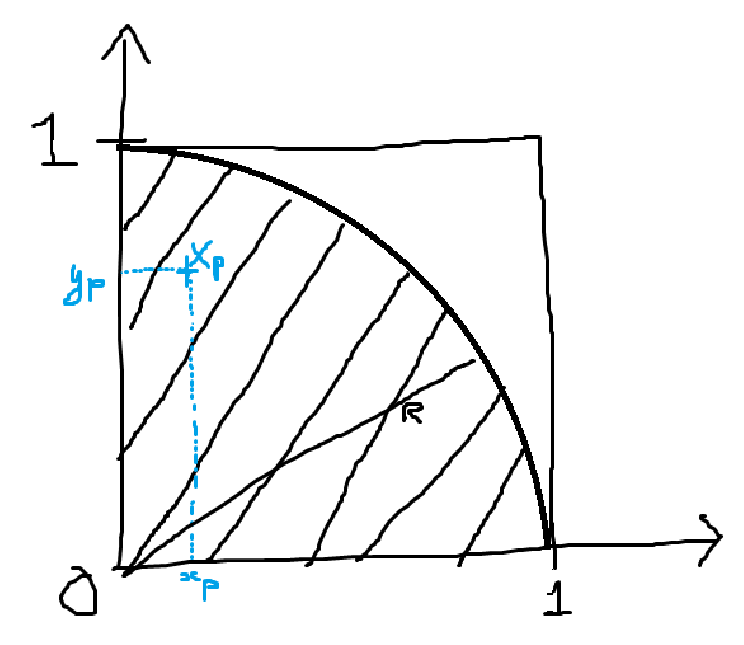
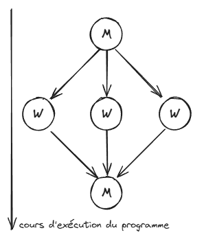
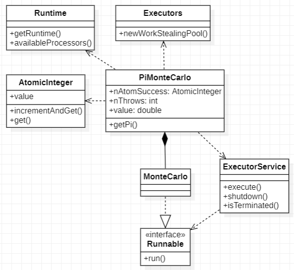
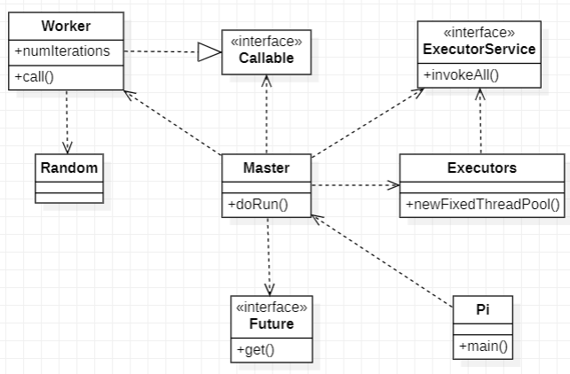

# **Introduction**

Ce rapport explore l'utilisation de la méthode de Monte Carlo (MC) pour calculer π en exploitant le parallélisme sur des architectures à mémoire partagée et distribuée. Après une présentation de l’algorithme séquentiel, nous étudions des variantes parallèles (itération parallèle, maître-esclave) et analysons deux implémentations Java.

Enfin, nous étendons l’étude aux environnements à mémoire distribuée et au parallélisme sur plusieurs machines, en évaluant les performances des différentes approches. Ce travail vise à fournir une vue synthétique et claire des stratégies et résultats obtenus.

Ce Rapport a été en partie rédigé par ChatGPT, dans le but de le simplifier et de le rendre le plus clair et concis possible.

# **I. Monte Carlo pour calculer π**

La méthode de Monte Carlo repose sur une estimation probabiliste pour approximer π à partir de tirages aléatoires.

Soit $A_{\text{quartD}}$ l’aire d’un quart de disque de rayon $r = 1$ :  
$$A_{\text{quartD}} = \frac{\pi r^2}{4} = \frac{\pi}{4}$$

Le quart de disque est inscrit dans un carré de côté $r = 1$, dont l’aire est :  
$$A_c = r^2 = 1$$

On considère un point $X_p(x_p, y_p)$ généré aléatoirement dans ce carré, où $x_p$ et $y_p$ suivent la loi uniforme $U(]0,1[)$.

La probabilité que $X_p$ appartienne au quart de disque est donnée par :  
$$P = \frac{A_{\text{quartD}}}{A_c} = \frac{\pi}{4}$$



Pour estimer cette probabilité, on effectue $n_{\text{tot}}$ tirages aléatoires. Soit $n_{\text{cible}}$ le nombre de points qui satisfont la condition $x_p^2 + y_p^2 \leq 1$, c’est-à-dire les points situés dans le quart de disque.

Si $n_{\text{tot}}$ est suffisamment grand, par la loi des grands nombres, la fréquence observée $n_{\text{cible}} / n_{\text{tot}}$ converge vers la probabilité $P$, soit :  
$$P = \frac{n_{\text{cible}}}{n_{\text{tot}}} \approx \frac{\pi}{4}$$

On peut ainsi en déduire une approximation de π :  
$$\pi \approx 4 \cdot \frac{n_{\text{cible}}}{n_{\text{tot}}}$$

Ainsi, plus $n_{\text{tot}}$ augmente, plus l'estimation de π se précise.

## **II. Algorithme et parallélisation**

### **A. Itération parallèle**

L’algorithme de Monte Carlo peut être parallélisé en distribuant les tirages sur plusieurs tâches indépendantes. Voici l'algorithme séquentiel de base :

#### **Algorithme de base**

```
n_cible = 0;
for (p = 0; n_tot > 0; n_tot--) {
    x_p = rand();  // Générer un nombre aléatoire entre ]0,1[
    y_p = rand();
    if ((x_p * x_p + y_p * y_p) < 1) {
        n_cible++;
    }
}
pi = 4 * n_cible / n_tot;
```

Dans cette version, tout est exécuté séquentiellement. Pour paralléliser ce code, il faut identifier les tâches du programme et leurs dépendances afin de déterminer celles qui peuvent être exécutées en parallèle.

#### **Tâches identifiées**

1. **Tâche principale (T0) :** Tirer et compter les `n_tot` points.
    - **Sous-tâche T0p1 :** Générer `x_p` et `y_p`.
    - **Sous-tâche T0p2 :** Vérifier si `x_p^2 + y_p^2 < 1` et incrémenter `n_cible` si c'est le cas.

2. **Tâche secondaire (T1) :** Calculer `pi` une fois `n_cible` déterminé :
   `pi = 4 * n_cible / n_tot;`

#### **Dépendances entre tâches**

- **T1 dépend de T0 :** `pi` ne peut être calculé qu’après la collecte de `n_cible`.
- **T0p2 dépend de T0p1 :** Un point doit être généré avant de vérifier s’il appartient au quart de disque.
- **Indépendances parallèles :**
    - Les `T0p1` (génération des points) peuvent être exécutées en parallèle, car chaque point est indépendant.
    - Les `T0p2` (vérifications et comptage) peuvent également être parallélisées. Cependant, cela nécessite une gestion spécifique des accès à `n_cible`, car plusieurs threads peuvent modifier cette variable simultanément.

Ainsi, on a identifié une section critique, et une ressource partagée :

- **Section critique :** `n_cible++;`

  Plusieurs threads peuvent tenter de modifier `n_cible` en même temps.

- **Ressource partagée :**

  L’accès à `n_cible` doit être protégé pour éviter des conflits d'accès simultané.

#### **Algorithme parallèle**

L'algorithme parallèle repose sur une fonction dédiée `TirerPoint()` pour générer et évaluer les points :

```
function TirerPoint() {
    x_p = rand();  // Générer un nombre aléatoire entre ]0,1[
    y_p = rand();
    return ((x_p * x_p + y_p * y_p) < 1);
}

n_cible = 0;
parallel for (p = 0; n_tot > 0; n_tot--) {
    if (TirerPoint()) {
        n_cible++;
    }
}
pi = 4 * n_cible / n_tot;
```

La fonction `TirerPoint()` n’a pas de dépendance, chaque tirage peut être exécuté indépendamment sur plusieurs threads.

### **B. Master/Worker**

Dans le paradigme Master/Worker, le travail est divisé en plusieurs unités indépendantes, chacune étant attribuée à un processus (ou thread) dit **"Worker"**. Ici, chaque Worker exécute une partie des tirages de manière itérative, et le résultat est ensuite combiné par un processus maître, dit **"Master"**.



#### **Algorithme Master/Worker**

```
function TirerPoint() {
    x_p = rand();  // Générer un nombre aléatoire entre ]0,1[
    y_p = rand();
    return ((x_p * x_p + y_p * y_p) < 1);
}

function MCWorker(n_charge) {
    n_cible_partiel = 0;
    for (p = 0; n_charge > 0; n_charge--) {
        if (TirerPoint()) {
            n_cible_partiel += 1;
        }
    }
    return n_cible_partiel;
}

n_charge = n_tot / n_workers;
ncibles = [NULL * n_workers];
parallel for (worker = 0; worker < n_workers; worker++) {
    ncibles[worker] = MCWorker(n_charge);
}
n_cible = sum(ncibles);
pi = 4 * n_cible / n_tot;
```

#### **Explications**

1. **Principe :**
    - Le travail total (`n_tot` tirages) est réparti uniformément entre les `n_workers` processus ou threads.
    - Chaque Worker exécute la fonction `MCWorker()` sur son propre sous-ensemble de points (`n_charge` tirages).

2. **Ressources partagées et sections critiques :**  
   Contrairement à l'itération parallèle, chaque Worker maintient son propre compteur local (`n_cible_partiel`). Ainsi chaque Worker peut travailler de son côté sans entrer dans des conflits d’accès lors de l’incrémentation.

3. **Tableau `ncibles` :** La seule ressource critique ici est un tableau, afin d'éviter les conflits d'accès. La section critique est ainsi prise en charge, car chaque Worker n'a besoin d'accéder qu'à sa case mémoire dédiée. 

4. **Agrégation :**  
   Une fois les calculs des Workers terminés, le Master (programme principal) combine leurs résultats (somme de `ncibles`) pour obtenir la valeur totale de `n_cible`, et calcule ensuite π.

#### **Avantages du modèle Master/Worker**

- **Réduction des conflits :** Chaque Worker travaille sur des données locales, réduisant le besoin de synchronisation.
- **Scalabilité :** La charge est répartie uniformément entre les Workers, ce qui peut améliorer les performances sur un grand nombre de threads. Nous testerons cela dans la **IVème partie**.
- **Modularité :** La structure facilite l’adaptation à des architectures distribuées, où les Workers peuvent s’exécuter sur des machines distinctes. Nous testerons cela dans la **VIIème partie**.

## **III. Mise en œuvre sur Machine**

Nous allons maintenant étudier deux implémentations pratiques de la méthode de Monte Carlo pour le calcul de π. L'objectif est d'analyser leur structure et leur approche de parallélisation :

1. Identifier le **modèle de programmation parallèle** utilisé dans chaque code ainsi que le **paradigme suivi** (itération parallèle ou Master/Worker).
2. Vérifier si ces implémentations correspondent aux algorithmes proposés en **partie II**.

Nous effectuerons ensuite dans la **partie IV** une analyse détaillée de chaque code en évaluant leur scalabilité forte et faible.

### **A. Analyse Assignment102**

L'implémentation **Assignment102** utilise l'API Concurrent pour paralléliser les calculs nécessaires à l'estimation de π avec la méthode de Monte Carlo. Voici les points principaux analysés :

#### **Structure et API utilisée**



- **Gestion des threads :**
    - Le code utilise `ExecutorService` avec un **pool de threads adaptatif** (`newWorkStealingPool`), exploitant efficacement les cœurs disponibles sur la machine.
    - Chaque tirage (génération d’un point aléatoire) est exécuté dans une tâche indépendante via `Runnable`.
- **Synchronisation avec AtomicInteger :**
    - La variable partagée `nAtomSuccess`, qui compte le nombre de points dans le quart de disque, est protégée par un **compteur atomique** (`AtomicInteger`) pour éviter les conflits d’accès entre threads.

#### **Modèle de programmation parallèle et paradigme**

- **Modèle utilisé :** Itération parallèle. Chaque tirage correspond à une tâche indépendante soumise au pool de threads.
- **Paradigme :** Le code suit le modèle d’**itération parallèle** décrit dans la partie II.A. Chaque tâche effectue un tirage de manière indépendante, sans dépendances entre elles.

#### **Lien avec notre pseudo-code**

L'implémentation correspond globalement au pseudo-code d'**itération parallèle** proposé, avec les adaptations suivantes :
- Le compteur `n_cible` est remplacé par un `AtomicInteger` pour gérer les sections critiques.
- Le découplage des threads est entièrement géré par l’API `ExecutorService`.

#### **Limites et optimisation possibles**

1. **Impact des accès atomiques :**
    - Chaque incrémentation de `nAtomSuccess` via `incrementAndGet()` est coûteuse en termes de synchronisation, ce qui peut provoquer des **goulots d’étranglement**. On parle presque de **75% du temps d'exécution** pouvant être consacré uniquement à la gestion des accès atomiques.

2. **Optimisation possible :**
    - **Regroupement local :** Chaque thread pourrait maintenir un compteur local pour `nAtomSuccess`, et ces valeurs pourraient être agrégées à la fin, réduisant la contention.
    - **Filtrage des points hors cible :** Plutôt que d'incrémenter le compteur atomique à chaque point DANS la cible, on pourrait le faire quand ils sont en dehors, et simplement prendre la valeur inverse de la variable pour le calcul de Pi.

En conclusion, bien que cette implémentation soit correcte et facilement compréhensible, elle est limitée par des problèmes d’optimisation liés à la synchronisation atomique.

### **B. Analyse Pi.java**

L'implémentation **Pi.java** repose sur l'utilisation des **Futures** et des **Callables** pour paralléliser le calcul de π à l'aide de la méthode de Monte Carlo.

#### **Qu’est-ce qu’un `Future` ?**

Un `Future` est un conteneur pour un résultat calculé de manière asynchrone. Il permet :
- **De soumettre une tâche :** Lorsqu'une tâche est exécutée par un thread, son résultat est encapsulé dans un `Future`.
- **De récupérer le résultat :** L'appel à `get()` permet de récupérer la valeur, mais bloque jusqu'à ce que le calcul soit terminé. Cela introduit une **barrière implicite** qui synchronise les résultats des différents threads.
- **De vérifier l'état d'exécution :** Un `Future` peut également indiquer si la tâche est terminée ou si elle a échoué.

Ici, les `Futures` permettent de gérer la synchronisation entre les threads de manière simple et efficace, en garantissant que chaque résultat partiel est prêt avant l'agrégation.



#### **Modèle de programmation parallèle et paradigme**

- **Modèle utilisé :** Master/Worker. Le **Master** crée des `Workers` (tâches) pour effectuer les calculs de Monte Carlo, et il regroupe les résultats des `Futures` pour produire le résultat final.
- **Paradigme :** Basé sur les tâches avec gestion explicite des tâches via des `Callables`.

#### **Structure et API utilisée**

1. **Parallélisation avec des `Callables` :**
    - Chaque `Worker` est implémenté comme un `Callable<Long>` qui effectue un sous-ensemble du calcul total, à savoir déterminer le nombre de points tombant dans le quart de disque pour un certain nombre d'itérations.
    - Ces `Callables` sont ensuite exécutés par un pool de threads fixe (`FixedThreadPool`), permettant leur exécution en parallèle.

2. **Gestion des résultats avec des `Futures` :**
    - Lorsqu'un `Callable` est soumis au pool de threads, il renvoie un objet `Future<Long>` qui représente un résultat futur.
    - L'appel à `Future.get()` bloque le thread principal jusqu'à ce que le calcul associé au `Callable` soit terminé.
    - Une fois tous les résultats collectés, ils sont agrégés pour calculer la valeur finale de π.

#### **Lien avec notre pseudo-code**

L'algorithme suit fidèlement la logique **Master/Worker** définie en partie II.B :
- **Master :** Correspond à la classe `Master`, qui distribue les tâches aux `Workers` et agrège leurs résultats.
- **Workers :** Implémentés via les `Callables`, chaque `Worker` exécute localement la méthode `MCWorker()` de notre pseudo-code.
- **Division équitable :** Le `Master` divise uniformément les tirages (`n_charge`) entre les différents `Workers`.

#### **Comparaison avec Assignment102**

1. **Isolation des calculs :**
    - Chaque `Worker` calcule ses résultats localement sans dépendre d’une variable partagée, ce qui élimine le besoin d’outils comme `AtomicInteger`.

2. **Moins de synchronisation coûteuse :**
    - Le recours aux `Futures` permet de retarder la synchronisation jusqu'à l'agrégation finale, réduisant les coûts liés à l'accès concurrent.

3. **Efficacité :**
    - En minimisant la gestion des ressources partagées et en optimisant l'utilisation des threads, cette implémentation est mieux adaptée aux environnements multithread, en particulier sur des machines multicœurs.

On peut donc s'attendre à de meilleures performances qu'`Assignment102` au moment au test de performances, particulièrement avec un grand nombre de points et de threads.
