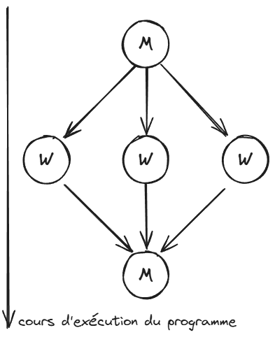
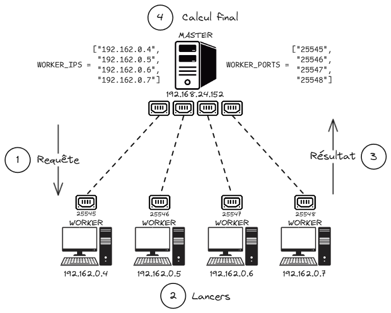

# **Introduction**

Ce rapport explore l'utilisation de la méthode de Monte Carlo (MC) pour calculer π en exploitant le parallélisme sur des architectures à mémoire partagée et distribuée. Après une présentation de l’algorithme séquentiel, nous étudions des variantes parallèles (itération parallèle, maître-esclave) et analysons deux implémentations Java.

Enfin, nous étendons l’étude aux environnements à mémoire distribuée et au parallélisme sur plusieurs machines, en évaluant les performances des différentes approches. Ce travail vise à fournir une vue synthétique et claire des stratégies et résultats obtenus.

Ce Rapport a été en partie rédigé par ChatGPT, dans le but de le simplifier et de le rendre le plus clair et concis possible.

# **I. Monte Carlo pour calculer π**

La méthode de Monte Carlo repose sur une estimation probabiliste pour approximer π à partir de tirages aléatoires.

Soit $A_{\text{quartD}}$ l’aire d’un quart de disque de rayon $r = 1$ :  
$$A_{\text{quartD}} = \frac{\pi r^2}{4} = \frac{\pi}{4}$$

Le quart de disque est inscrit dans un carré de côté $r = 1$, dont l’aire est :  
$$A_c = r^2 = 1$$

On considère un point $X_p(x_p, y_p)$ généré aléatoirement dans ce carré, où $x_p$ et $y_p$ suivent la loi uniforme $U(]0,1[)$.

La probabilité que $X_p$ appartienne au quart de disque est donnée par :  
$$P = \frac{A_{\text{quartD}}}{A_c} = \frac{\pi}{4}$$


Pour estimer cette probabilité, on effectue $n_{\text{tot}}$ tirages aléatoires. Soit $n_{\text{cible}}$ le nombre de points qui satisfont la condition $x_p^2 + y_p^2 \leq 1$, c’est-à-dire les points situés dans le quart de disque.

Si $n_{\text{tot}}$ est suffisamment grand, par la loi des grands nombres, la fréquence observée $n_{\text{cible}} / n_{\text{tot}}$ converge vers la probabilité $P$, soit :  
$$P = \frac{n_{\text{cible}}}{n_{\text{tot}}} \approx \frac{\pi}{4}$$

On peut ainsi en déduire une approximation de π :  
$$\pi \approx 4 \cdot \frac{n_{\text{cible}}}{n_{\text{tot}}}$$

Ainsi, plus $n_{\text{tot}}$ augmente, plus l'estimation de π se précise.

## **II. Algorithme et parallélisation**

### **A. Itération parallèle**

L’algorithme de Monte Carlo peut être parallélisé en distribuant les tirages sur plusieurs tâches indépendantes. Voici l'algorithme séquentiel de base :

#### **Algorithme de base**

```
n_cible = 0;
for (p = 0; n_tot > 0; n_tot--) {
    x_p = rand();  // Générer un nombre aléatoire entre ]0,1[
    y_p = rand();
    if ((x_p * x_p + y_p * y_p) < 1) {
        n_cible++;
    }
}
pi = 4 * n_cible / n_tot;
```

Dans cette version, tout est exécuté séquentiellement. Pour paralléliser ce code, il faut identifier les tâches du programme et leurs dépendances afin de déterminer celles qui peuvent être exécutées en parallèle.

#### **Tâches identifiées**

1. **Tâche principale (T0) :** Tirer et compter les `n_tot` points.
    - **Sous-tâche T0p1 :** Générer `x_p` et `y_p`.
    - **Sous-tâche T0p2 :** Vérifier si `x_p^2 + y_p^2 < 1` et incrémenter `n_cible` si c'est le cas.

2. **Tâche secondaire (T1) :** Calculer `pi` une fois `n_cible` déterminé :
   `pi = 4 * n_cible / n_tot;`

#### **Dépendances entre tâches**

- **T1 dépend de T0 :** `pi` ne peut être calculé qu’après la collecte de `n_cible`.
- **T0p2 dépend de T0p1 :** Un point doit être généré avant de vérifier s’il appartient au quart de disque.
- **Indépendances parallèles :**
    - Les `T0p1` (génération des points) peuvent être exécutées en parallèle, car chaque point est indépendant.
    - Les `T0p2` (vérifications et comptage) peuvent également être parallélisées. Cependant, cela nécessite une gestion spécifique des accès à `n_cible`, car plusieurs threads peuvent modifier cette variable simultanément.

Ainsi, on a identifié une section critique, et une ressource partagée :

- **Section critique :** `n_cible++;`

  Plusieurs threads peuvent tenter de modifier `n_cible` en même temps.

- **Ressource partagée :**

  L’accès à `n_cible` doit être protégé pour éviter des conflits d'accès simultané.

#### **Algorithme parallèle**

L'algorithme parallèle repose sur une fonction dédiée `TirerPoint()` pour générer et évaluer les points :

```
function TirerPoint() {
    x_p = rand();  // Générer un nombre aléatoire entre ]0,1[
    y_p = rand();
    return ((x_p * x_p + y_p * y_p) < 1);
}

n_cible = 0;
parallel for (p = 0; n_tot > 0; n_tot--) {
    if (TirerPoint()) {
        n_cible++;
    }
}
pi = 4 * n_cible / n_tot;
```

La fonction `TirerPoint()` n’a pas de dépendance, chaque tirage peut être exécuté indépendamment sur plusieurs threads.

### **B. Master/Worker**

Dans le paradigme Master/Worker, le travail est divisé en plusieurs unités indépendantes, chacune étant attribuée à un processus (ou thread) dit **"Worker"**. Ici, chaque Worker exécute une partie des tirages de manière itérative, et le résultat est ensuite combiné par un processus maître, dit **"Master"**.



#### **Algorithme Master/Worker**

```
function TirerPoint() {
    x_p = rand();  // Générer un nombre aléatoire entre ]0,1[
    y_p = rand();
    return ((x_p * x_p + y_p * y_p) < 1);
}

function MCWorker(n_charge) {
    n_cible_partiel = 0;
    for (p = 0; n_charge > 0; n_charge--) {
        if (TirerPoint()) {
            n_cible_partiel += 1;
        }
    }
    return n_cible_partiel;
}

n_charge = n_tot / n_workers;
ncibles = [NULL * n_workers];
parallel for (worker = 0; worker < n_workers; worker++) {
    ncibles[worker] = MCWorker(n_charge);
}
n_cible = sum(ncibles);
pi = 4 * n_cible / n_tot;
```

#### **Explications**

1. **Principe :**
    - Le travail total (`n_tot` tirages) est réparti uniformément entre les `n_workers` processus ou threads.
    - Chaque Worker exécute la fonction `MCWorker()` sur son propre sous-ensemble de points (`n_charge` tirages).

2. **Ressources partagées et sections critiques :**  
   Contrairement à l'itération parallèle, chaque Worker maintient son propre compteur local (`n_cible_partiel`). Ainsi chaque Worker peut travailler de son côté sans entrer dans des conflits d’accès lors de l’incrémentation.

3. **Tableau `ncibles` :** La seule ressource critique ici est un tableau, afin d'éviter les conflits d'accès. La section critique est ainsi prise en charge, car chaque Worker n'a besoin d'accéder qu'à sa case mémoire dédiée. 

4. **Agrégation :**  
   Une fois les calculs des Workers terminés, le Master (programme principal) combine leurs résultats (somme de `ncibles`) pour obtenir la valeur totale de `n_cible`, et calcule ensuite π.

#### **Avantages du modèle Master/Worker**

- **Réduction des conflits :** Chaque Worker travaille sur des données locales, réduisant le besoin de synchronisation.
- **Scalabilité :** La charge est répartie uniformément entre les Workers, ce qui peut améliorer les performances sur un grand nombre de threads. Nous testerons cela dans la **IVème partie**.
- **Modularité :** La structure facilite l’adaptation à des architectures distribuées, où les Workers peuvent s’exécuter sur des machines distinctes. Nous testerons cela dans la **VIIème partie**.

## **III. Mise en œuvre sur Machine**

Nous allons maintenant étudier deux implémentations pratiques de la méthode de Monte Carlo pour le calcul de π. L'objectif est d'analyser leur structure et leur approche de parallélisation :

1. Identifier le **modèle de programmation parallèle** utilisé dans chaque code ainsi que le **paradigme suivi** (itération parallèle ou Master/Worker).
2. Vérifier si ces implémentations correspondent aux algorithmes proposés en **partie II**.

Nous effectuerons ensuite dans la **partie IV** une analyse détaillée de chaque code en évaluant leur scalabilité forte et faible.

### **A. Analyse Assignment102**

L'implémentation **Assignment102** utilise l'API Concurrent pour paralléliser les calculs nécessaires à l'estimation de π avec la méthode de Monte Carlo. Voici les points principaux analysés :

#### **Structure et API utilisée**


- **Gestion des threads :**
    - Le code utilise `ExecutorService` avec un **pool de threads adaptatif** (`newWorkStealingPool`), exploitant efficacement les cœurs disponibles sur la machine.
    - Chaque tirage (génération d’un point aléatoire) est exécuté dans une tâche indépendante via `Runnable`.
- **Synchronisation avec AtomicInteger :**
    - La variable partagée `nAtomSuccess`, qui compte le nombre de points dans le quart de disque, est protégée par un **compteur atomique** (`AtomicInteger`) pour éviter les conflits d’accès entre threads.

#### **Modèle de programmation parallèle et paradigme**

- **Modèle utilisé :** Itération parallèle. Chaque tirage correspond à une tâche indépendante soumise au pool de threads.
- **Paradigme :** Le code suit le modèle d’**itération parallèle** décrit dans la partie II.A. Chaque tâche effectue un tirage de manière indépendante, sans dépendances entre elles.

#### **Lien avec notre pseudo-code**

L'implémentation correspond globalement au pseudo-code d'**itération parallèle** proposé, avec les adaptations suivantes :
- Le compteur `n_cible` est remplacé par un `AtomicInteger` pour gérer les sections critiques.
- Le découplage des threads est entièrement géré par l’API `ExecutorService`.

#### **Limites et optimisation possibles**

1. **Impact des accès atomiques :**
    - Chaque incrémentation de `nAtomSuccess` via `incrementAndGet()` est coûteuse en termes de synchronisation, ce qui peut provoquer des **goulots d’étranglement**. On parle presque de **75% du temps d'exécution** pouvant être consacré uniquement à la gestion des accès atomiques.

2. **Optimisation possible :**
    - **Regroupement local :** Chaque thread pourrait maintenir un compteur local pour `nAtomSuccess`, et ces valeurs pourraient être agrégées à la fin, réduisant la contention.
    - **Filtrage des points hors cible :** Plutôt que d'incrémenter le compteur atomique à chaque point DANS la cible, on pourrait le faire quand ils sont en dehors, et simplement prendre la valeur inverse de la variable pour le calcul de Pi.

En conclusion, bien que cette implémentation soit correcte et facilement compréhensible, elle est limitée par des problèmes d’optimisation liés à la synchronisation atomique.

### **B. Analyse Pi.java**

L'implémentation **Pi.java** repose sur l'utilisation des **Futures** et des **Callables** pour paralléliser le calcul de π à l'aide de la méthode de Monte Carlo.

#### **Qu’est-ce qu’un `Future` ?**

Un `Future` est un conteneur pour un résultat calculé de manière asynchrone. Il permet :
- **De soumettre une tâche :** Lorsqu'une tâche est exécutée par un thread, son résultat est encapsulé dans un `Future`.
- **De récupérer le résultat :** L'appel à `get()` permet de récupérer la valeur, mais bloque jusqu'à ce que le calcul soit terminé. Cela introduit une **barrière implicite** qui synchronise les résultats des différents threads.
- **De vérifier l'état d'exécution :** Un `Future` peut également indiquer si la tâche est terminée ou si elle a échoué.

Ici, les `Futures` permettent de gérer la synchronisation entre les threads de manière simple et efficace, en garantissant que chaque résultat partiel est prêt avant l'agrégation.


#### **Modèle de programmation parallèle et paradigme**

- **Modèle utilisé :** Master/Worker. Le **Master** crée des `Workers` (tâches) pour effectuer les calculs de Monte Carlo, et il regroupe les résultats des `Futures` pour produire le résultat final.
- **Paradigme :** Basé sur les tâches avec gestion explicite des tâches via des `Callables`.

#### **Structure et API utilisée**

1. **Parallélisation avec des `Callables` :**
    - Chaque `Worker` est implémenté comme un `Callable<Long>` qui effectue un sous-ensemble du calcul total, à savoir déterminer le nombre de points tombant dans le quart de disque pour un certain nombre d'itérations.
    - Ces `Callables` sont ensuite exécutés par un pool de threads fixe (`FixedThreadPool`), permettant leur exécution en parallèle.

2. **Gestion des résultats avec des `Futures` :**
    - Lorsqu'un `Callable` est soumis au pool de threads, il renvoie un objet `Future<Long>` qui représente un résultat futur.
    - L'appel à `Future.get()` bloque le thread principal jusqu'à ce que le calcul associé au `Callable` soit terminé.
    - Une fois tous les résultats collectés, ils sont agrégés pour calculer la valeur finale de π.

#### **Lien avec notre pseudo-code**

L'algorithme suit fidèlement la logique **Master/Worker** définie en partie II.B :
- **Master :** Correspond à la classe `Master`, qui distribue les tâches aux `Workers` et agrège leurs résultats.
- **Workers :** Implémentés via les `Callables`, chaque `Worker` exécute localement la méthode `MCWorker()` de notre pseudo-code.
- **Division équitable :** Le `Master` divise uniformément les tirages (`n_charge`) entre les différents `Workers`.

#### **Comparaison avec Assignment102**

1. **Isolation des calculs :** Chaque `Worker` calcule ses résultats localement sans dépendre d’une variable partagée, ce qui élimine le besoin d’outils comme `AtomicInteger`.

2. **Moins de synchronisation coûteuse :** Le recours aux `Futures` permet de retarder la synchronisation jusqu'à l'agrégation finale, réduisant les coûts liés à l'accès concurrent.

3. **Efficacité :** En minimisant la gestion des ressources partagées et en optimisant l'utilisation des threads, cette implémentation est mieux adaptée aux environnements multithread, en particulier sur des machines multicœurs.

On peut donc s'attendre à de meilleures performances qu'`Assignment102` au moment au test de performances, particulièrement avec un grand nombre de points et de threads.

## IV. Évaluations et tests de performances

La partie suivante contient des éléments d'un autre rapport que j'écris en parallèle de celui-ci, qui concerne le module de Qualité de Développement en troisième année de BUT informatique.

L'ordinateur qui a réalisé ces calculs possède les specs suivantes :
- **Processeur :** 11th Gen Intel(R) Core(TM) i7-11800H @ 2.30GHz
- 8 cœurs physiques
- 16 cœurs logiques

Notez que les résultats des tests qui suivent ne seront pas les mêmes selon l'architecture matérielle sur lesquels ils ont été effectués.

### **A. Programme de calcul de performance**

Le script PerformanceTester.java teste différentes implémentations de Monte Carlo pour calculer π en s'appuyant sur une interface standardisée (`MonteCarloImplementation`). Chaque implémentation doit fournir deux méthodes : `execute(int totalPoints, int numCores)` et `getName()`.

Il récupère les données de tests (nombre de cœurs, de points, et répétitions) dans un fichier csv, effectue les tests sur chaque implémentation puis enregistre les résultats (temps d'exécution, approximation de π, erreur relative) dans un fichier `resultats.csv`.

L'outil est modulaire, permettant d'ajouter facilement de nouvelles versions de Monte Carlo à tester, tout en automatisant l'évaluation des performances pour différents scénarios.

### **B. Tests de Scalabilité**

Nous allons réaliser les mêmes tests sur tous les codes, afin de pouvoir les comparer plus efficacement. On compare les performances des différents codes en termes de scalabilité, en évaluant leur capacité à s'adapter à une augmentation du nombre de cœurs, selon deux approches : **scalabilité forte** et **scalabilité faible**.

#### **1. Scalabilité Forte**

La **scalabilité forte** mesure la capacité d'un programme à réduire son temps d'exécution lorsqu'on augmente le nombre de cœurs, tout en maintenant la charge de travail totale constante. Elle évalue comment le programme exploite efficacement les ressources supplémentaires.

On l'évalue à l'aide du **speedup**, défini comme :

```
Speedup = Temps_1_cœur / Temps_N_cœurs
```

Un speedup idéal est linéaire (e.g., un gain proportionnel au nombre de cœurs).


Pour la scalabilité forte, on maintient la charge totale constante (le nombre de points) tout en augmentant le nombre de processeurs. Les expériences se répartissent comme suit :

| **Nombre de processeurs** | **Nombre total de points** | **Points par processeur** |  
|---------------------------|----------------------------|---------------------------|  
| 1                         | 1,000,000                  | 1,000,000                 |  
| 2                         | 1,000,000                  | 500,000                   |  
| 4                         | 1,000,000                  | 250,000                   |  
| 8                         | 1,000,000                  | 125,000                   |  
| 16                        | 1,000,000                  | 62,500                    |  
| 1                         | 10,000,000                 | 10,000,000                |  
| 2                         | 10,000,000                 | 5,000,000                 |  
| 4                         | 10,000,000                 | 2,500,000                 |  
| 8                         | 10,000,000                 | 1,250,000                 |  
| 16                        | 10,000,000                 | 625,000                   |  
| 1                         | 100,000,000                | 100,000,000               |  
| 2                         | 100,000,000                | 50,000,000                |  
| 4                         | 100,000,000                | 25,000,000                |  
| 8                         | 100,000,000                | 12,500,000                |  
| 16                        | 100,000,000                | 6,250,000                 |  

#### **2. Scalabilité Faible**

La **scalabilité faible** évalue la capacité d'un programme à maintenir un temps d'exécution constant lorsqu'on augmente proportionnellement le nombre de cœurs **et** la charge de travail totale. Cela simule un scénario où chaque cœur traite une part fixe de travail supplémentaire.

Elle est également mesurée à l'aide du **speedup**, calculé comme dans la scalabilité forte, mais ici avec une charge croissante. Ici, le speedup idéal est constant, une droite qui reste horizontale.

Pour la scalabilité faible, on augmente proportionnellement la charge totale en fonction du nombre de processeurs, de façon à maintenir une charge constante par processeur. Les expériences se répartissent comme suit :

| **Nombre de processeurs** | **Nombre total de points** | **Points par processeur** |  
|---------------------------|----------------------------|---------------------------|  
| 1                         | 1,000,000                  | 1,000,000                 |  
| 2                         | 2,000,000                  | 1,000,000                 |  
| 4                         | 4,000,000                  | 1,000,000                 |  
| 8                         | 8,000,000                  | 1,000,000                 |  
| 16                        | 16,000,000                 | 1,000,000                 |  
| 1                         | 10,000,000                 | 10,000,000                |  
| 2                         | 20,000,000                 | 10,000,000                |  
| 4                         | 40,000,000                 | 10,000,000                |  
| 8                         | 80,000,000                 | 10,000,000                |  
| 16                        | 160,000,000                | 10,000,000                |  
| 1                         | 100,000,000                | 100,000,000               |  
| 2                         | 200,000,000                | 100,000,000               |  
| 4                         | 400,000,000                | 100,000,000               |  
| 8                         | 800,000,000                | 100,000,000               |  
| 16                        | 1,600,000,000              | 100,000,000               |  

### **C. Résultats Assignment102**

Pour évaluer la scalabilité de l'implémentation `Assignment102`, nous avons modifié le code pour permettre de fixer le nombre de processeurs utilisés via l'initialisation de la classe `PiMonteCarlo`. Cela remplace l'utilisation dynamique de `Runtime.getRuntime().availableProcessors()` et nous permet de limiter précisément le nombre de cœurs pour chaque test.

Voici les résultats obtenus lors des tests de scalabilité forte, répétés 5 fois pour avoir une moyenne :

#### **Tableau des résultats de scalabilité forte**

| **Nombre de cœurs** | **Points lancés** | **Points par cœur** | **Temps d'exécution (ms)** | **Approximation de π** | **Erreur**          |  
|---------------------|-------------------|---------------------|----------------------------|------------------------|---------------------|
| 1                   | 1,000,000         | 1,000,000           | 92.0                       | 3.1414976              | 3.03 × 10⁻⁵         |  
| 2                   | 1,000,000         | 500,000             | 84.2                       | 3.1398992              | 5.39 × 10⁻⁴         |  
| 4                   | 1,000,000         | 250,000             | 92.6                       | 3.14152                | 2.31 × 10⁻⁵         |  
| 8                   | 1,000,000         | 125,000             | 126.2                      | 3.1420408              | 1.43 × 10⁻⁴         |  
| 16                  | 1,000,000         | 62,500              | 127.2                      | 3.1411                 | 1.57 × 10⁻⁴         |  
| 1                   | 10,000,000        | 10,000,000          | 836.8                      | 3.14186112             | 8.55 × 10⁻⁵         |  
| 2                   | 10,000,000        | 5,000,000           | 206.4                      | 3.14125008             | 1.09 × 10⁻⁴         |  
| 4                   | 10,000,000        | 2,500,000           | 819.8                      | 3.14155624             | 1.16 × 10⁻⁵         |  
| 8                   | 10,000,000        | 1,250,000           | 869.0                      | 3.1418644              | 8.65 × 10⁻⁵         |  
| 16                  | 10,000,000        | 625,000             | 925.4                      | 3.14146304             | 4.13 × 10⁻⁵         |  
| 1                   | 100,000,000       | 100,000,000         | 8,788.0                    | 3.141590984            | 5.31 × 10⁻⁷         |  
| 2                   | 100,000,000       | 50,000,000          | 8,358.2                    | 3.141534816            | 1.84 × 10⁻⁵         |  
| 4                   | 100,000,000       | 25,000,000          | 8,743.0                    | 3.141645944            | 1.70 × 10⁻⁵         |  
| 8                   | 100,000,000       | 12,500,000          | 8,728.4                    | 3.141609744            | 5.44 × 10⁻⁶         |  
| 16                  | 100,000,000       | 6,250,000           | 8,625.2                    | 3.1416518              | 1.88 × 10⁻⁵         |  

En utilisant un programme Python pour calculer le speedup et générer un graphique, on obtient la courbe suivante :


L'analyse des résultats montre que le speedup commence à 1, puis baisse avant de stagner sous 1. Cette diminution de performance peut être due à plusieurs facteurs :

- **Surcharge de synchronisation** : L'utilisation de `AtomicInteger` pour la gestion des ressources partagées introduit une latence, ralentissant les threads à mesure que leur nombre augmente.
- **Overhead lié aux threads** : La gestion des threads devient coûteuse lorsque le nombre de cœurs dépasse un certain seuil, annulant les gains de parallélisation.
- **Tâches trop petites** : L'overhead de la synchronisation devient plus important que les bénéfices de la parallélisation avec de petites charges de travail par processeur.

Ces facteurs expliquent la baisse du speedup et indiquent que l'implémentation n'est pas optimale au-delà d'un certain nombre de cœurs.

#### **Tableau des résultats de scalabilité faible**

Voici le tableau des résultats pour les tests de scalabilité faible d'Assignment102, répétés 5 fois pour avoir une moyenne :

| Nombre de cœurs | Points lancés | Points par cœur | Temps d'exécution (ms) | Approximation de π  | Erreur  |
|-----------------|---------------|-----------------|------------------------|---------------------|---------|
| 1               | 1,000,000     | 1,000,000       | 120.2                  | 3.1432696           | 5.34e-4 |
| 2               | 2,000,000     | 1,000,000       | 205.0                  | 3.141348            | 7.79e-5 |
| 4               | 4,000,000     | 1,000,000       | 354.6                  | 3.1415638           | 9.18e-6 |
| 8               | 8,000,000     | 1,000,000       | 773.6                  | 3.1415113           | 2.59e-5 |
| 16              | 16,000,000    | 1,000,000       | 1456.8                 | 3.1415671           | 8.13e-6 |
| 1               | 10,000,000    | 10,000,000      | 943.8                  | 3.14194448          | 1.12e-4 |
| 2               | 20,000,000    | 10,000,000      | 1826.0                 | 3.14176164          | 5.38e-5 |
| 4               | 40,000,000    | 10,000,000      | 3875.0                 | 3.14177182          | 5.70e-5 |
| 8               | 80,000,000    | 10,000,000      | 10112.6                | 3.14151361          | 2.52e-5 |
| 16              | 160,000,000   | 10,000,000      | 20315.6                | 3.141623355         | 9.77e-6 |
| 1               | 100,000,000   | 100,000,000     | 11313.8                | 3.141555048         | 1.20e-5 |

Les tests se limitent ici pour `Assignment102` en raison de problèmes d'optimisation, causant une erreur `OutOfMemory` pour des charges de travail plus importantes. Cette limitation est un indicateur de la mauvaise gestion des ressources dans cette implémentation, notamment pour de très grandes quantités de points.

Voici le speedup calculé par le même programme python pour la scalabilité faible :


Comme on peut l'observer, la scalabilité est loin d'être linéaire. Elle semble décroître proportionnellement au nombre de points ajoutés. En effet, chaque fois que l'on double le nombre de points, le speedup est réduit de moitié.

Ce résultat n'est toutefois pas surprenant, étant donné celui observé lors du test de scalabilité forte. Le speedup était presque linéaire, ce qui suggère que l'ajout de processus a un impact quasi-inexistant sur la performance du programme. Par conséquent, doubler le nombre de points entraîne logiquement un temps d'exécution deux fois plus long.

#### **Test d'efficacité (Effectiveness)**

Assignment102 présente des résultats mitigés en termes de scalabilité, mais démontre une certaine efficacité dans le calcul de π.

Pour évaluer cette efficacité, nous avons analysé l'erreur moyenne en fonction du nombre total de points lancés. Le graphique suivant illustre cette relation :


On observe que l'erreur diminue globalement à mesure que le nombre total de points augmente, bien que des fluctuations sporadiques soient présentes. La médiane de l'erreur calculée est de **2.59 × 10⁻⁵**, indiquant que malgré les limites de l'implémentation en termes de scalabilité, l'estimation de π reste relativement précise.

Cependant, cette analyse reste incomplète sans une comparaison directe avec d'autres implémentations similaires, telles que *Pi.java*. Cela permettra de mieux évaluer l'efficacité relative de *Assignment102* dans un contexte plus large.

### **D. Résultats Pi.Java**

Aucune modification n'a été nécessaire pour cette classe, qui intègre déjà une option permettant de limiter le nombre de workers.

#### **Tableau des résultats de scalabilité forte**

Voici les résultats obtenus lors des tests de scalabilité forte, répétés 5 fois pour calculer une moyenne :

| Nombre de cœurs | Points lancés | Points par cœur | Temps d'exécution (ms) | Approximation de π  | Erreur            |
|-----------------|---------------|-----------------|------------------------|---------------------|-------------------|
| 1               | 1,000,000     | 1,000,000       | 56.8                   | 3.1431048           | 4.81 × 10⁻⁴       |
| 2               | 1,000,000     | 500,000         | 27.0                   | 3.141724            | 4.18 × 10⁻⁵       |
| 4               | 1,000,000     | 250,000         | 14.4                   | 3.1408              | 2.52 × 10⁻⁴       |
| 8               | 1,000,000     | 125,000         | 11.6                   | 3.1418616           | 8.56 × 10⁻⁵       |
| 16              | 1,000,000     | 62,500          | 8.0                    | 3.1423224           | 2.32 × 10⁻⁴       |
| 1               | 10,000,000    | 10,000,000      | 414.0                  | 3.14151048          | 2.62 × 10⁻⁵       |
| 2               | 10,000,000    | 5,000,000       | 217.8                  | 3.1416816           | 2.83 × 10⁻⁵       |
| 4               | 10,000,000    | 2,500,000       | 122.4                  | 3.14141312          | 5.71 × 10⁻⁵       |
| 8               | 10,000,000    | 1,250,000       | 68.4                   | 3.14099672          | 1.90 × 10⁻⁴       |
| 16              | 10,000,000    | 625,000         | 59.0                   | 3.14134416          | 7.91 × 10⁻⁵       |
| 1               | 100,000,000   | 100,000,000     | 4335.0                 | 3.141607864         | 4.84 × 10⁻⁶       |
| 2               | 100,000,000   | 50,000,000      | 2421.2                 | 3.141605256         | 4.01 × 10⁻⁶       |
| 4               | 100,000,000   | 25,000,000      | 1250.4                 | 3.141652968         | 1.92 × 10⁻⁵       |
| 8               | 100,000,000   | 12,500,000      | 677.4                  | 3.141578304         | 4.57 × 10⁻⁶       |
| 16              | 100,000,000   | 6,250,000       | 412.0                  | 3.141576256         | 5.22 × 10⁻⁶       |

La courbe suivante représente le speedup obtenu :


Comme on peut le constater, la courbe suit une trajectoire presque linéaire sur une large plage de points, avant de légèrement dévier au-delà de 8 cœurs. Malgré cela, le speedup reste croissant, ce qui témoigne d'une parallélisation efficace.

Avec 8 cœurs physiques (avec 2 coeurs logiques chacun), l'implémentation atteint une performance équivalente à environ 11 cœurs logiques. Cela confirme l'efficacité de la parallélisation dans ce code.

#### **Tableau des résultats de scalabilité faible**

| Nombre de cœurs | Points lancés  | Points par cœur | Temps d'exécution (ms) | Approximation de π  | Erreur            |
|-----------------|----------------|-----------------|------------------------|---------------------|-------------------|
| 1               | 1,000,000      | 1,000,000       | 63.0                   | 3.1423984           | 2.56 × 10⁻⁴       |
| 2               | 2,000,000      | 1,000,000       | 56.2                   | 3.1412836           | 9.84 × 10⁻⁵       |
| 4               | 4,000,000      | 1,000,000       | 64.6                   | 3.1418568           | 8.41 × 10⁻⁵       |
| 8               | 8,000,000      | 1,000,000       | 109.6                  | 3.1417325           | 4.45 × 10⁻⁵       |
| 16              | 16,000,000     | 1,000,000       | 156.4                  | 3.14142355          | 5.38 × 10⁻⁵       |
| 1               | 10,000,000     | 10,000,000      | 530.8                  | 3.14203488          | 1.41 × 10⁻⁴       |
| 2               | 20,000,000     | 10,000,000      | 552.0                  | 3.14175008          | 5.01 × 10⁻⁵       |
| 4               | 40,000,000     | 10,000,000      | 534.4                  | 3.14163064          | 1.21 × 10⁻⁵       |
| 8               | 80,000,000     | 10,000,000      | 579.4                  | 3.14150764          | 2.71 × 10⁻⁵       |
| 16              | 160,000,000    | 10,000,000      | 776.2                  | 3.1415749           | 5.65 × 10⁻⁶       |
| 1               | 100,000,000    | 100,000,000     | 4662.4                 | 3.141613336         | 6.58 × 10⁻⁶       |
| 2               | 200,000,000    | 100,000,000     | 5105.6                 | 3.14153096          | 1.96 × 10⁻⁵       |
| 4               | 400,000,000    | 100,000,000     | 5256.0                 | 3.141570872         | 6.93 × 10⁻⁶       |
| 8               | 800,000,000    | 100,000,000     | 7791.6                 | 3.141575614         | 5.42 × 10⁻⁶       |
| 16              | 1,600,000,000  | 100,000,000     | 8710.6                 | 3.141579264         | 4.26 × 10⁻⁶       |

La courbe suivante illustre le speedup observé :


On peut voir que le speedup **décroît** lentement au fur et à mesure que le nombre de processeurs augmente. Bien que cette décroissance soit bien plus modérée que dans le cas d'Assignment102, le speedup passe tout de même de **1** (avec un seul processeur) à environ **0,75** avec 16 processeurs.

Cette baisse indique que le code `Pi.java` perd en efficacité parallèle avec l'augmentation des ressources disponibles, mais cette perte reste contenue. Cela pourrait être lié à des surcoûts croissants liés à la gestion des threads ou à une saturation progressive de la capacité à paralléliser les calculs supplémentaires de manière optimale. Cela reste néanmoins un résultat globalement satisfaisant comparé à Assignment102, où la scalabilité chute bien plus rapidement.

#### **Test d'efficacité (Effectiveness)**

Pour évaluer l’efficacité de l’approximation de π, nous avons analysé un nuage de points représentant la moyenne des erreurs obtenues pour chaque configuration du nombre total de points utilisés.


Le graphique révèle une répartition bien plus régulière des erreurs par rapport à Assignment102, avec une tendance claire à la décroissance lorsque le nombre de points augmente. La médiane de l’erreur est de **2.71 × 10⁻⁵** pour Pi.java, contre **2.59 × 10⁻⁵** pour Assignment102.

Bien que l’erreur médiane soit légèrement plus élevée pour Pi.java, sa distribution est beaucoup plus cohérente et moins erratique que celle d’Assignment102. Par conséquent, il est difficile de conclure qu’un code est systématiquement meilleur que l’autre pour évaluer π, car les écarts observés pourraient résulter de variations aléatoires plutôt que d’une véritable différence d’efficacité.

## **V. Mise en œuvre en mémoire distribuée**

Les analyses précédentes ont démontré que le paradigme Master/Worker est plus efficace en termes de parallélisation comparé à l’approche adoptée par *Assignment102*. Nous souhaitons maintenant porter cet algorithme sur une architecture à mémoire distribuée.

Conformément au cours, le paradigme Master/Worker peut être vu comme l'opposé du paradigme Client/Serveur. Dans ce modèle, le *Maître* agit comme un client, tandis que les *Workers* jouent le rôle de serveurs.

On va donc étudier une implémentation reposant sur ce paradigme, où les échanges se font via des sockets Java. Le code fourni fonctionne déjà, mais il ne contient pas encore la partie dédiée au calcul de Pi.


Dans cette architecture, un Master Socket est utilisé pour initialiser l'expérience Monte Carlo. Ce dernier répartit le travail entre un certain nombre de Worker Sockets en leur attribuant le nombre de points à traiter. Chaque Worker Socket réalise alors ses calculs (actuellement, il ne fait que renvoyer une valeur approximative) et renvoie son résultat au Master.


Les échanges entre le Master Socket et les Worker Sockets reposent sur les classes de la bibliothèque `java.net`. Les flux de données sont gérés par `InputStreamReader` et `OutputStreamWriter`. Les classes `PrintWriter` et `BufferedWriter` sont utilisées pour envoyer des messages, tandis que `BufferedReader` permet de les lire.

Pour exécuter le programme, il faut lancer différentes instances de WorkerSocket et MasterSocket. Dans le cas de WorkerSocket, il est nécessaire de donner en argument au lancement le port sur lequel il doit écrire/lire les flux de données. Et dans le cas de MasterWorker, au démarrage, un prompt demande d'entrer le nombre de Workers à utiliser et leurs ports.

Note : En réalité, les ports que l'on entre au lancement du Master n'ont aucune importance puisque le programme prendra toujours les ports 25545, 25546... et ainsi de suite jusqu'à avoir assez de ports pour affecter chaque Worker.

### **A. Implémentation calcul par méthode**


Pour implémenter la partie calcul de Pi, une méthode `performMonteCarloComputation` a été ajoutée. Cette méthode est appelée lorsque le Worker reçoit une demande de calcul : il traite sa part de points Monte Carlo avant de transmettre le résultat au Master.

### **B. Implémentation calcul en utilisant Pi.java**

Bien que l'ajout d'une méthode dédiée au calcul Monte Carlo soit une approche fonctionnelle, une alternative plus intéressante consiste à réutiliser le programme que nous avons déjà conçu, à savoir l'algorithme de *Pi.java*. Ainsi, la classe *Master* de *Pi.java* est intégrée directement dans le *WorkerSocket*.

Cette approche donne lieu à une architecture *Master/Worker* multi-niveaux :

- Au premier niveau, un Master Socket répartit les tâches entre plusieurs Worker Sockets sur une architecture à mémoire distribuée.
- Au second niveau, chaque Worker Socket devient le *Master* d'une architecture *Master/Worker* à mémoire partagée, grâce à l'implémentation déjà existante de *Pi.java*.

Ce modèle, appelé *Programmation Multi-Niveaux*, exploite les avantages de deux types de parallélisme : le parallélisme sur mémoire distribuée au niveau supérieur et le parallélisme sur mémoire partagée au niveau inférieur.

Nous explorerons les possibilités qu'une telle architecture nous offre dans la **partie VII**, mais pour le moment, il nous faut évaluer ce nouveau code comme nous l'avons fait avec *Assignment102* et *Pi.java*.

## **VI. Performance MW distribué**

Comme pour la précédente partie dédiée à l'évaluation de performance, la majorité de la partie suivante vient du rapport de Qualité de Développement.

Pour évaluer la performance de l'implémentation distribuée en utilisant Sockets, nous allons répéter la procédure de test que nous avons utilisée pour *Assignment102* et *Pi.java*, mais cette fois sur l'architecture Master/Worker distribuée avec la communication par Sockets. Comme précédemment, le script *PerformanceTester.java* sera utilisé pour exécuter les tests définis en **partie IV**.

### A. Mise en place de l'environnement de test

#### 1. **Création de la classe `SocketImplementation`**

La classe `SocketImplementation` sert à faire le lien entre la classe de test `PerformanceTester` et les classes `MasterSocket` et `WorkerSocket`. Cette classe implémente l'interface `MonteCarloImplementation` et gère la création et l'exécution des processus Master et Worker, en leur fournissant les ports à utiliser pour la communication.

#### 2. **Modification du code MasterSocket**

Pour adapter le code du *MasterSocket* à notre architecture distribuée, nous apportons les modifications suivantes :

- **Augmentation de la capacité du serveur :** Nous passons le paramètre `maxServer` de 8 à 16 pour permettre au Master de gérer jusqu'à 16 Workers.
- **Ajout de ports dynamiques :** Nous modifions le code afin que les ports sur lesquels les Workers doivent écouter soient spécifiés par la classe *SocketImplementation*. Cela permet une plus grande flexibilité, notamment pour tester avec un nombre variable de Workers et sur différents ports.
- **Création de la méthode `executeDistributedMonteCarlo` :** Cette méthode centralise toute la logique de distribution du travail entre les Workers. Elle prend en entrée le nombre de Workers et le nombre de points à traiter, et renvoie le résultat du calcul de Pi. Elle assure également la gestion des connexions entre le Master et les Workers.
- **Simplification de l’exécution du programme :** Nous retirons la partie qui permettait de répéter l’expérience, car cela nous gêne dans les tests. La méthode `main` se charge désormais uniquement de passer les informations (ports, nombre de Workers) et d'afficher le résultat.

#### 3. **Modification du code WorkerSocket**

Du côté des *WorkerSockets*, nous apportons les modifications suivantes :

- **Méthode `main` simplifiée :** main ne sert maintenant qu'à récupérer le port dans les arguments. Nous créons une méthode `start` qui s'occupe de tout le reste. Cette méthode prend un port en argument et s'assure que le Worker s'exécute correctement.
- **Suppression du champ statique `port` :** Pour faciliter l'exécution concurrente des Workers sur différents ports, nous retirons le champ statique `port` de la classe *WorkerSocket*. Cela permet de lancer plusieurs Workers avec des ports différents sans avoir à modifier le champ statique à chaque fois.

Les modifications des codes *WorkerSocket* et *MasterSocket* ne changent pas leur fonctionnement précédent, ils permettent uniquement d'adapter le code pour qu'il soit également utilisable au sein de notre environnement de test défini.

#### 4. **Problèmes rencontrés avec les ports occupés**

Lors des tests, nous rencontrons un problème majeur : les Workers ne parviennent pas à lancer un Socket sur leur port, et par conséquent, ils ne peuvent pas communiquer avec le Master. Bien que les ports soient attribués correctement, le processus de connexion entre le Master et les Workers échoue systématiquement.

- **Problème des ports occupés :** Un des problèmes apparents est que les ports semblent rester occupés après chaque test, empêchant ainsi les Workers de se connecter lors du test suivant. Cela peut être lié à la gestion des ressources réseau dans l'environnement de test multi-threadé.

- **Problème de connexion entre Master et Worker :** Le problème principal réside dans l'incapacité des Workers à établir une connexion sur les ports qui leur sont attribués. Cela empêche la communication entre le Master et les Workers, ce qui est essentiel pour que l'implémentation distribuée fonctionne correctement.

#### 5. **Solution archaïque**

Comme le fichier fonctionne malgré tout si l'on n'exécute qu'un seul et unique test, on va simplement utiliser un fichier CSV contenant le test à effectuer. Ensuite, nous modifierons son contenu pour passer au test suivant, et ainsi de suite.

C'est une solution certes archaïque, mais elle a l'avantage de nous permettre de contourner les problèmes rencontrés avec la gestion des ports et la connexion entre le Master et les Workers. En attendant une solution plus robuste, cette méthode est plus pratique que de devoir lancer manuellement chaque Worker et le Master.

On retiendra toutefois que le problème auquel nous faisons face souligne bien les défis pratiques d'un environnement de test distribué, où la gestion des ressources réseau et des communications inter-processus peut entraîner des complications non triviales.

### **A. Scalabilité forte**

Voici les résultats obtenus lors des tests de scalabilité **forte**, répétés 5 fois pour avoir une moyenne :

| Nombre de cœurs | Points lancés | Points par cœur | Temps d'exécution (ms) | Approximation de π | Erreur   |
|-----------------|---------------|-----------------|------------------------|--------------------|----------|
| 1               | 1,000,000     | 1,000,000       | 73.0                   | 3.143948           | 7.50e-04 |
| 2               | 1,000,000     | 500,000         | 64.0                   | 3.142872           | 4.07e-04 |
| 4               | 1,000,000     | 250,000         | 69.0                   | 3.141884           | 9.27e-05 |
| 8               | 1,000,000     | 125,000         | 77.0                   | 3.144052           | 7.83e-04 |
| 16              | 1,000,000     | 62,500          | 82.0                   | 3.13932            | 7.23e-04 |
| 1               | 10,000,000    | 10,000,000      | 431.0                  | 3.14191            | 1.01e-04 |
| 2               | 10,000,000    | 5,000,000       | 246.0                  | 3.1418472          | 8.10e-05 |
| 4               | 10,000,000    | 2,500,000       | 157.0                  | 3.1413616          | 7.35e-05 |
| 8               | 10,000,000    | 1,250,000       | 121.0                  | 3.1433472          | 5.58e-04 |
| 16              | 10,000,000    | 625,000         | 113.0                  | 3.1420676          | 1.51e-04 |
| 1               | 100,000,000   | 100,000,000     | 3852.0                 | 3.14177476         | 5.80e-05 |
| 2               | 100,000,000   | 50,000,000      | 1978.0                 | 3.14156944         | 7.39e-06 |
| 4               | 100,000,000   | 25,000,000      | 1060.0                 | 3.14206908         | 1.52e-04 |
| 8               | 100,000,000   | 12,500,000      | 597.0                  | 3.14178068         | 5.99e-05 |
| 16              | 100,000,000   | 6,250,000       | 385.0                  | 3.14167344         | 2.57e-05 |

Et voici la courbe du speedup résultante de ces données :


L'analyse de ces données se fera dans la **Partie C**.

---

### **B. Scalabilité faible**

Voici les résultats obtenus lors des tests de scalabilité **faible**, répétés 5 fois pour avoir une moyenne :

| Nombre de cœurs | Points lancés | Points par cœur | Temps d'exécution (ms) | Approximation de π | Erreur   |
|-----------------|---------------|-----------------|------------------------|--------------------|----------|
| 1               | 1,000,000     | 1,000,000       | 82.0                   | 3.142072           | 1.53e-04 |
| 2               | 2,000,000     | 1,000,000       | 89.0                   | 3.140634           | 3.05e-04 |
| 4               | 4,000,000     | 1,000,000       | 99.0                   | 3.141566           | 8.48e-06 |
| 8               | 8,000,000     | 1,000,000       | 113.0                  | 3.141138           | 1.45e-04 |
| 16              | 16,000,000    | 1,000,000       | 130.0                  | 3.1410735          | 1.65e-04 |
| 1               | 10,000,000    | 10,000,000      | 565.0                  | 3.1419212          | 1.05e-04 |
| 2               | 20,000,000    | 10,000,000      | 585.0                  | 3.14124            | 1.12e-04 |
| 4               | 40,000,000    | 10,000,000      | 637.0                  | 3.1415226          | 2.23e-05 |
| 8               | 80,000,000    | 10,000,000      | 691.0                  | 3.14171455         | 3.88e-05 |
| 16              | 160,000,000   | 10,000,000      | 775.0                  | 3.1417597          | 5.32e-05 |
| 1               | 100,000,000   | 100,000,000     | 3822.0                 | 3.14168248         | 2.86e-05 |
| 2               | 200,000,000   | 100,000,000     | 3868.0                 | 3.1416229          | 9.63e-06 |
| 4               | 400,000,000   | 100,000,000     | 3992.0                 | 3.14153771         | 1.75e-05 |
| 8               | 800,000,000   | 100,000,000     | 4239.0                 | 3.141590915        | 5.53e-07 |
| 16              | 1,600,000,000 | 100,000,000     | 5063.0                 | 3.1416164525       | 7.58e-06 |

Et voici la courbe du speedup résultante de ces données :


L'analyse de ces données se fera dans la **Partie C**.

---

#### **Test d'efficacité (Effectiveness)**

Comme pour Assignment102 et Pi.java, voici un nuage de points des erreurs de cette implémentation :


Pour cette implémentation, le nuage de points représentant les erreurs montre une similarité marquée avec celui de Pi.java. Cependant, l’erreur médiane est plus élevée, à **5.32 × 10⁻⁵**, contre **2.71 × 10⁻⁵** pour Pi.java.

Un point notable est que les valeurs de l’erreur et de l’approximation de π ont été relevées manuellement dans cette implémentation. Cela pourrait introduire des imprécisions dans les moyennes calculées, bien qu’il soit difficile d’en évaluer l’impact exact. Globalement, malgré une erreur légèrement supérieure, l’efficacité reste comparable à celle de Pi.java, et les variations observées sont probablement dues aux processus de mesure.

### C. Analyse/Conclusion

Nous avons fait des tests de performance sur tous les codes que nous avons vu jusqu'à présent. Il est maintenant temps de les comparer.

#### **Courbes de scalabilité forte en fonction du nombre de points :**


#### **Courbes de scalabilité faible en fonction du nombre de points :**


Rappel : Assignment102 n'a pas pu réaliser les tests de scalabilité faible pour 100000000 de points par worker à cause d'un manque de mémoire.

#### **Scalabilté forte**

Dans le cas de la scalabilité forte (nombre total de points constant), nous avons observé les comportements suivants :

1. **Assignment102** :
    - Comme établi précédemment, Assignment102 a une scalabilité forte très mauvaise.
    - Elle reste constamment proche de 1, et n'augmente pas.

2. **Pi.java** :
    - Pi.java a la meilleure scalabilité forte des 3 codes.
    - Le speedup est quasi-idéal, suivant de près la courbe et ne faisant que s'améliorer avec un plus grand nombre de points.

3. **MW Socket** :
    - L'implémentation MW en Socket est un cas particulièrement intéressant.
    - Il a une scalabilité forte similaire à *Assignment102* avec peu de points, et similaire à *Pi.java* avec beaucoup de points.

En résumé, `Pi.java` a la meilleure scalabilité forte sur tous les nombres de points, mais `MW Socket` semble s'améliorer avec un plus grand nombre. On peut imaginer que cette implémentation pourrait éventuellement dépasser Pi.java avec un nombre suffisant de points.

#### **Scalabilité faible**

Pour la scalabilité faible (nombre de points par worker constant), les résultats sont les suivants :

1. **Assignment102** :
    - Là encore, comme pour la scalabilité forte, Assignment102 a une scalabilité faible très mauvaise.
    - Le speedup est divisé par 2 à chaque fois que le nombre de points/worker est multiplié par 2, indiquant une quasi-inutilité de l'ajout du nombre de workers.

2. **Pi.java** :
    - Pi.java a une scalabilité faible correcte, mais qui baisse de manière toujours plutôt conséquente.
    - De plus, on remarque qu'avec 1000000 de points, le speedup de Pi.java passe au dessus de la bare des 1.0. Ce qui est conforme aux données, mais qui reste difficile à expliquer.

3. **MW Socket** :
    - L'implémentation MW en Socket a la meilleure scalabilité faible des 3 codes.
    - Bien que le speedup de Pi.java lui soit supérieur en dessous de 16 workers sur 1000000 et 10000000 de points, il finit toujours par repasser au dessus.
    - Et arrivé à 100000000, le speedup de Pi.java est complètement en dessous de celui du MW Socket.

MW Socket a donc un avantage ici, bien que l'efficacité décroit au fur et à mesure que les ressources augmentent comme pour `Pi.java`.

#### **Limites et recommandations**

1. **Assignment102** :
- Limites :
    - Très mauvaise scalabilité, à la fois forte et faible.
    - Impossibilité d'exécuter des tests avec un nombre important de points par worker, probablement dû à une gestion inefficace de la mémoire.
- Recommandations :
    - Revoir complètement la structure de ce code. Il serait pertinent d'implémenter une meilleure gestion des tâches et des communications entre workers.
    - Tester d'autres approches algorithmiques pour améliorer l'utilisation des ressources.

2. **Pi.java** :
- Limites :
    - Scalabilité faible qui baisse avec le nombre croissant de workers.
    - Algorithme bon mais qui ne fonctionne qu'en mémoire partagée, difficile donc à porter sur d'autres infrastructures.
- Recommandations :
    - Limiter l'utilisation de cette implémentation à des scénarios de mémoire partagée pour éviter les contraintes liées à la distribution.

3. **MW Socket** :
- Limites :
    - Bien que la scalabilité faible soit la meilleure, elle diminue tout de même encore significativement avec l'augmentation du nombre de workers.
    - L'implémentation par sockets peut engendrer une surcharge de communication, surtout avec un grand nombre de workers.
- Recommandations :
    - Optimiser la gestion des communications entre les workers pour réduire les surcharges liées aux sockets.
    - Utiliser cette implémentation pour des cas nécessitant une mémoire distribuée et où la charge peut être suffisamment répartie.

En guise de conclusion, MW Socket est l'implémentation préférable pour des scénarios à mémoire distribuée, Pi.java est préférable pour une mémoire partagée uniquement, tandis qu'Assignment102 n'est pas viable pour une utilisation pratique.

## **VII. Parallélisation sur plusieurs machines physiques**

Jusqu'ici, nous avons exécuté notre code Master/Worker en Socket sur une seule et même machine. Cela signifie que bien qu'il fonctionne par envoi de message, le code a jusqu'ici toujours tourné sur une mémoire partagée, et non véritablement distribuée.

La dernière chose à faire est donc de porter ce code sur plusieurs machines physiques, afin de véritablement faire travailler chaque Worker sur des mémoires différentes. Pour cela, il a fallu légèrement modifier la classe MasterSocket pour qu'elle puisse avoir accès, en plus de leurs ports, à l'adresse IP des machines sur lesquels se trouvent les Workers.

### **A. Expérience mémoire distribuée**

Cette expérience a été réalisée dans la salle G24 de l'IUT de Vélizy. Problème : La salle G24 a un pare-feu sur le windows de ses machines qui nous empêche de les faire communiquer entre elles. Il est donc nécessaire d'utiliser les systèmes CentOS, qui ne sont pas restreints, mais nécessitent que l'on installe Java afin de pouvoir compiler et exécuter notre code.

Voici les différentes étapes suivies pour mener à bien cette expérience :

#### 1. **Préparation des machines :**

- Configurer les machines des Workers et du Master pour qu'elles soient prêtes à exécuter leur fonction et à communiquer entre elles.
- Pour cela, on installe l'outil de développement Java avec la commande `sudo yum install java-devel` sur chaque machine.

#### 2. **Ouverture des ports sur les Workers :**

- IMPORTANT : Chaque Worker doit utiliser un port TCP distinct pour communiquer avec le Master. Deux Workers ne peuvent pas utiliser le même port, sinon ce dernier sera surchargé.
- Pour ouvrir des ports spécifiques dans le pare-feu, il nous suffit d'exécuter la commande `firewall-cmd --zone=public --add-port=25545/tcp` sur chaque Worker _(ici le port 25545)_.

#### 3. **Déploiement et compilation du code :**

- Une fois les machines configurées et les ports ouverts, il ne reste plus qu'à installer le code Java sur chaque Worker et sur le Master. On compilera le code avec la commande `javac *.java`.

#### 4. **Lancement des Workers :**

- Les Workers sont lancés en premier, comme on l'a fait pour les tests sur une seule machine. On lance donc sur chaque machine Worker la commande suivante `./java Workersocket 25545` _(évidemment ici 25545 est un exemple, il faut le remplacer par le port attribué au worker sur lequel on lance la commande)_.

#### 5. **Lancement du Master :**

- Une fois tous les Workers lancés et en écoute, on peut lancer le Master. On lui fournit chaque Worker par son adresse IP et son port, un par un.

#### 6. **Exécution :**

 

- Si les étapes précédentes ont été réalisées correctement, le Master arrive à envoyer des requêtes aux Workers, et les Workers arrivent à renvoyer leur résultat au Master.
- On rappelle que chaque WorkerSocket utilise donc le code Pi.java sur les machines où ils sont exécutés. Pour le moment, on limite le nombre de Workers de Pi.java à 1, car on fera une troisième expérience pour l'architecture Multi-Niveaux.

#### 7. **Résultats :**

- Une fois le calcul terminé, les résultats sont affichés sur la console comme précédemment, incluant toutes les informations nécessaires.

#### **Conclusion**

Nous avons ainsi réussi à faire communiquer entre eux différents Workers avec leur Master, chacun sur des machines différentes et donc sur des mémoires différentes. On a ainsi véritablement fait de la programmation en mémoire distribuée, et il ne nous reste plus qu'à tester la programmation à multi-niveaux, qui sera le sujet de notre expérience suivante.

### **B. Expérience mémoire distribuée avec plusieurs Workers par machine**

Pour cette expérience, nous avons utilisé la majeure partie des ordinateurs de la salle G24, chaque machine configurée avec **un Worker par cœur**, soit **4 Workers par machine**. Un ordinateur distinct hébergeait le **MasterSocket**, chargé de coordonner les communications avec l’ensemble des **WorkerSockets**. Grâce à cette infrastructure, nous disposions d’un total de **48 cœurs** pour effectuer les calculs de π via la méthode Monte Carlo.


En exploitant cette configuration, des tests de **scalabilité forte** et **scalabilité faible** ont été réalisés à une échelle nettement plus grande. Seuls les temps d’exécution ont été mesurés ici, car ils constituent la métrique principale de cette analyse.

#### **Expériences de scalabilité forte**

Les résultats des tests de scalabilité **forte**, répétés cinq fois pour calculer une moyenne, sont présentés ci-dessous :

| Nombre de cœurs | Points lancés | Points par cœur | Temps d'exécution (ms) |
|-----------------|---------------|-----------------|------------------------|
| 1               | 192,000,000   | 192,000,000     | 5,873                  |
| 4               | 192,000,000   | 48,000,000      | 1,506                  |
| 8               | 192,000,000   | 24,000,000      | 756                    |
| 12              | 192,000,000   | 16,000,000      | 508                    |
| 16              | 192,000,000   | 12,000,000      | 385                    |
| 24              | 192,000,000   | 8,000,000       | 267                    |
| 32              | 192,000,000   | 6,000,000       | 206                    |
| 48              | 192,000,000   | 4,000,000       | 133                    |  

La courbe du **speedup** résultant de ces données est présentée ci-dessous :


Les résultats montrent une excellente **scalabilité forte**. La courbe obtenue est presque linéaire et suit de très près le **speedup idéal**. Même avec **48 Workers**, l’écart avec la courbe idéale est inférieur à **5**. De plus, on observe une phase initiale **superlinéaire** au début de la courbe, où la courbe dépasse colle le speedup idéal avant de converger.

#### **Expériences de scalabilité faible**

Les résultats des tests de scalabilité **faible**, également répétés cinq fois pour obtenir une moyenne, sont présentés ci-dessous :

| Nombre de cœurs | Points lancés | Points par cœur | Temps d'exécution (ms) |
|-----------------|---------------|-----------------|------------------------|
| 1               | 16,000,000    | 16,000,000      | 129                    |
| 4               | 16,000,000    | 4,000,000       | 140                    |
| 8               | 32,000,000    | 4,000,000       | 143                    |
| 12              | 48,000,000    | 4,000,000       | 136                    |
| 16              | 64,000,000    | 4,000,000       | 134                    |
| 24              | 96,000,000    | 4,000,000       | 139                    |
| 32              | 128,000,000   | 4,000,000       | 140                    |
| 48              | 192,000,000   | 4,000,000       | 141                    |  

La courbe du **speedup** résultant de ces données est présentée ci-dessous :


Les résultats montrent également une très bonne **scalabilité faible**. Bien que la courbe présente quelques fluctuations initiales, elle tend à se stabiliser autour de **0.9** pour des charges de calcul plus importantes. Cela signifie que l’augmentation proportionnelle du nombre total de points à calculer avec le nombre de cœurs entraîne des temps d’exécution presque constants, confirmant l’efficacité de cette approche.

#### **Test d'efficacité (Effectiveness)**

Lors de ces tests, seul le temps d’exécution a été mesuré. L’erreur de calcul n’a pas pu être directement évaluée. Toutefois, pour les plus grands nombres de points traités, l’erreur observée était approximativement de l’ordre de **10⁻⁷**, indiquant une précision assez importante.

---

### **C. Expérience multi-niveaux**

L’ultime expérience consistait en une approche **multi-niveaux**. Contrairement à l’expérience précédente, chaque machine hébergeait un **WorkerSocket unique**, mais celui-ci contrôlait plusieurs Workers locaux sur **Pi.java**, soit 4 Workers au total en mémoire partagée. Ainsi, un **MasterSocket** communiquait avec les **WorkerSockets** (mémoire distribuée), et chaque WorkerSocket gérait ses propres Workers internes (mémoire partagée).


Cette configuration a permis d’améliorer significativement les performances, comme le montrent les résultats ci-dessous :

| Total Machines | Machines Master | Machines Worker | Points lancés | Points par Master | Points par Worker | Nombre de cœurs | Temps d'exécution (ms) |
|----------------|-----------------|-----------------|---------------|-------------------|-------------------|-----------------|------------------------|
| 16             | 4               | 16              | 192,000,000   | 48,000,000        | 12,000,000        | 16              | 106                    |
| 32             | 8               | 32              | 192,000,000   | 24,000,000        | 6,000,000         | 32              | 60                     |
| 48             | 12              | 48              | 192,000,000   | 16,000,000        | 4,000,000         | 48              | 44                     |  

Malgré le temps limité pour effectuer davantage de tests, ces résultats démontrent clairement une amélioration significative des temps d’exécution par rapport à l’approche précédente, qui utilisait **4 WorkerSockets par machine**.
