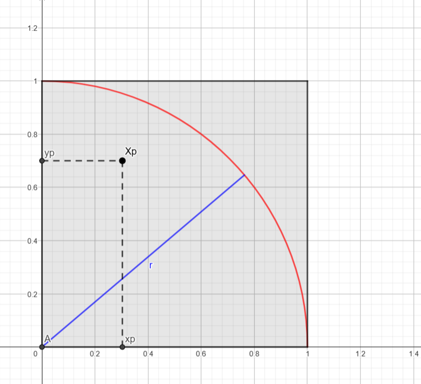

# **Introduction**

Ce rapport explore l'utilisation de la méthode de Monte Carlo (MC) pour calculer π en exploitant le parallélisme sur des architectures à mémoire partagée et distribuée. Après une présentation de l’algorithme séquentiel, nous étudions des variantes parallèles (itération parallèle, maître-esclave) et analysons deux implémentations Java.

Enfin, nous étendons l’étude aux environnements à mémoire distribuée et au parallélisme sur plusieurs machines, en évaluant les performances des différentes approches. Ce travail vise à fournir une vue synthétique et claire des stratégies et résultats obtenus.

Ce Rapport a été en partie rédigé par ChatGPT, dans le but de le simplifier et de le rendre le plus clair et concis possible.

# **I. Monte Carlo pour calculer π**

La méthode de Monte Carlo repose sur une estimation probabiliste pour approximer π à partir de tirages aléatoires.

Soit $A_{\text{quartD}}$ l’aire d’un quart de disque de rayon $r = 1$ :  
$$A_{\text{quartD}} = \frac{\pi r^2}{4} = \frac{\pi}{4}$$

Le quart de disque est inscrit dans un carré de côté $r = 1$, dont l’aire est :  
$$A_c = r^2 = 1$$

On considère un point $X_p(x_p, y_p)$ généré aléatoirement dans ce carré, où $x_p$ et $y_p$ suivent la loi uniforme $U(]0,1[)$.

La probabilité que $X_p$ appartienne au quart de disque est donnée par :  
$$P = \frac{A_{\text{quartD}}}{A_c} = \frac{\pi}{4}$$



Pour estimer cette probabilité, on effectue $n_{\text{tot}}$ tirages aléatoires. Soit $n_{\text{cible}}$ le nombre de points qui satisfont la condition $x_p^2 + y_p^2 \leq 1$, c’est-à-dire les points situés dans le quart de disque.

Si $n_{\text{tot}}$ est suffisamment grand, par la loi des grands nombres, la fréquence observée $n_{\text{cible}} / n_{\text{tot}}$ converge vers la probabilité $P$, soit :  
$$P = \frac{n_{\text{cible}}}{n_{\text{tot}}} \approx \frac{\pi}{4}$$

On peut ainsi en déduire une approximation de π :  
$$\pi \approx 4 \cdot \frac{n_{\text{cible}}}{n_{\text{tot}}}$$

Ainsi, plus $n_{\text{tot}}$ augmente, plus l'estimation de π se précise.

## **II. Algorithme et parallélisation**

### **A. Itération parallèle**

L’algorithme de Monte Carlo peut être parallélisé en distribuant les tirages sur plusieurs tâches indépendantes. Voici l'algorithme séquentiel de base :

#### **Algorithme de base**

```
n_cible = 0;
for (p = 0; n_tot > 0; n_tot--) {
    x_p = rand();  // Générer un nombre aléatoire entre ]0,1[
    y_p = rand();
    if ((x_p * x_p + y_p * y_p) < 1) {
        n_cible++;
    }
}
pi = 4 * n_cible / n_tot;
```

Dans cette version, tout est exécuté séquentiellement. Pour paralléliser ce code, il faut identifier les tâches du programme et leurs dépendances afin de déterminer celles qui peuvent être exécutées en parallèle.

#### **Tâches identifiées**

1. **Tâche principale (T0) :** Tirer et compter les `n_tot` points.
    - **Sous-tâche T0p1 :** Générer `x_p` et `y_p`.
    - **Sous-tâche T0p2 :** Vérifier si `x_p^2 + y_p^2 < 1` et incrémenter `n_cible` si c'est le cas.

2. **Tâche secondaire (T1) :** Calculer `pi` une fois `n_cible` déterminé :
   `pi = 4 * n_cible / n_tot;`

#### **Dépendances entre tâches**

- **T1 dépend de T0 :** `pi` ne peut être calculé qu’après la collecte de `n_cible`.
- **T0p2 dépend de T0p1 :** Un point doit être généré avant de vérifier s’il appartient au quart de disque.
- **Indépendances parallèles :**
    - Les `T0p1` (génération des points) peuvent être exécutées en parallèle, car chaque point est indépendant.
    - Les `T0p2` (vérifications et comptage) peuvent également être parallélisées. Cependant, cela nécessite une gestion spécifique des accès à `n_cible`, car plusieurs threads peuvent modifier cette variable simultanément.

Ainsi, on a identifié une section critique, et une ressource partagée :

- **Section critique :** `n_cible++;`

  Plusieurs threads peuvent tenter de modifier `n_cible` en même temps.

- **Ressource partagée :**

  L’accès à `n_cible` doit être protégé pour éviter des conflits d'accès simultané.

#### **Algorithme parallèle**

L'algorithme parallèle repose sur une fonction dédiée `TirerPoint()` pour générer et évaluer les points :

```
function TirerPoint() {
    x_p = rand();  // Générer un nombre aléatoire entre ]0,1[
    y_p = rand();
    return ((x_p * x_p + y_p * y_p) < 1);
}

n_cible = 0;
parallel for (p = 0; n_tot > 0; n_tot--) {
    if (TirerPoint()) {
        n_cible++;
    }
}
pi = 4 * n_cible / n_tot;
```

La fonction `TirerPoint()` n’a pas de dépendance, chaque tirage peut être exécuté indépendamment sur plusieurs threads.

### **B. Master/Worker**

Dans le paradigme Master/Worker, le travail est divisé en plusieurs unités indépendantes, chacune étant attribuée à un processus (ou thread) dit **"Worker"**. Ici, chaque Worker exécute une partie des tirages de manière itérative, et le résultat est ensuite combiné par un processus maître, dit **"Master"**.


#### **Algorithme Master/Worker**

```
function TirerPoint() {
    x_p = rand();  // Générer un nombre aléatoire entre ]0,1[
    y_p = rand();
    return ((x_p * x_p + y_p * y_p) < 1);
}

function MCWorker(n_charge) {
    n_cible_partiel = 0;
    for (p = 0; n_charge > 0; n_charge--) {
        if (TirerPoint()) {
            n_cible_partiel += 1;
        }
    }
    return n_cible_partiel;
}

n_charge = n_tot / n_workers;
ncibles = [NULL * n_workers];
parallel for (worker = 0; worker < n_workers; worker++) {
    ncibles[worker] = MCWorker(n_charge);
}
n_cible = sum(ncibles);
pi = 4 * n_cible / n_tot;
```

#### **Explications**

1. **Principe :**
    - Le travail total (`n_tot` tirages) est réparti uniformément entre les `n_workers` processus ou threads.
    - Chaque Worker exécute la fonction `MCWorker()` sur son propre sous-ensemble de points (`n_charge` tirages).

2. **Ressources partagées et sections critiques :**  
   Contrairement à l'itération parallèle, chaque Worker maintient son propre compteur local (`n_cible_partiel`). Ainsi chaque Worker peut travailler de son côté sans entrer dans des conflits d’accès lors de l’incrémentation.

3. **Tableau `ncibles` :** La seule ressource critique ici est un tableau, afin d'éviter les conflits d'accès. La section critique est ainsi prise en charge, car chaque Worker n'a besoin d'accéder qu'à sa case mémoire dédiée. 

4. **Agrégation :**  
   Une fois les calculs des Workers terminés, le Master (programme principal) combine leurs résultats (somme de `ncibles`) pour obtenir la valeur totale de `n_cible`, et calcule ensuite π.

#### **Avantages du modèle Master/Worker**

- **Réduction des conflits :** Chaque Worker travaille sur des données locales, réduisant le besoin de synchronisation.
- **Scalabilité :** La charge est répartie uniformément entre les Workers, ce qui peut améliorer les performances sur un grand nombre de threads. Nous testerons cela dans la **IVème partie**.
- **Modularité :** La structure facilite l’adaptation à des architectures distribuées, où les Workers peuvent s’exécuter sur des machines distinctes. Nous testerons cela dans la **VIIème partie**.

