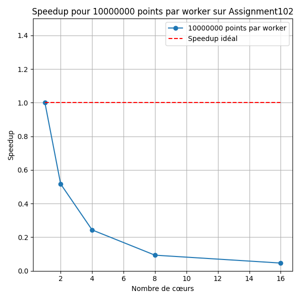
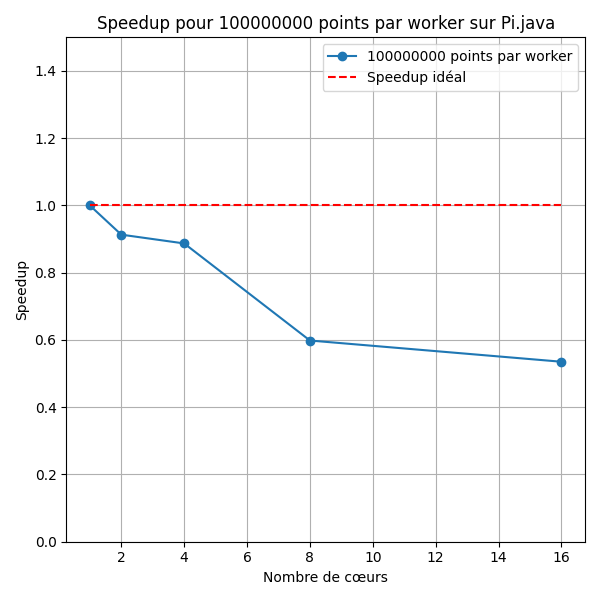
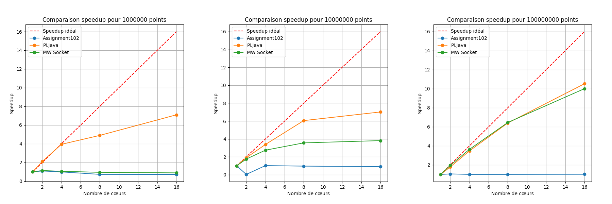

# Rapport de qualité de développement

Ce rapport a pour but de fournir un compte rendu détaillé de ce que j'ai appris et vu pendant le module de Qualité de Développement du 5ème semestre de BUT Informatique.

Il a été rédigé à l'aide de ChatGPT, dans le but de n'omettre aucune information et de le rendre plus facile à lire.

## **Introduction aux Normes ISO en Informatique**

Les normes ISO, élaborées par l’**Organisation internationale de normalisation**, établissent des spécifications et des recommandations visant à assurer la qualité, la sécurité, et l’efficacité des produits, services ou systèmes. Leur objectif est de standardiser les pratiques à l’échelle internationale.

Dans le domaine des technologies de l’information, plusieurs normes spécifiques ont été conçues pour encadrer et évaluer la qualité des logiciels. Parmi elles, les normes **ISO/IEC 9126** et **ISO/IEC 25010** se distinguent particulièrement pour leur approche de la qualité logicielle.

### **Historique et Évolution des Normes de Qualité Logicielle**

#### **ISO/IEC 9126 : La Première Norme de Qualité Logicielle**
Publiée le **19 décembre 1991**, la norme ISO/IEC 9126 a été l’une des premières à proposer une méthode systématique d’évaluation de la qualité des logiciels. Elle identifiait **six critères principaux** permettant d’analyser la qualité logicielle :
- Fonctionnalité (Functional Suitability)
- Efficacité (Performance Efficiency)
- Facilité d'utilisation (Usability)
- Fiabilité (Reliability)
- Maintenabilité (Maintainability)
- Portabilité (Portability)

En **2001**, cette norme a été révisée et divisée en **quatre parties distinctes** pour mieux structurer l’évaluation :
1. **Qualité interne** (aspects liés au code et à l'architecture)
2. **Qualité externe** (comportement du logiciel dans l’environnement immédiat)
3. **Qualité en utilisation** (satisfaction de l’utilisateur final dans un contexte spécifique)
4. **Mesures d’évaluation** (métriques utilisées pour juger ces qualités).

Bien que novatrice, cette norme a progressivement été remplacée par une version plus détaillée et adaptée aux évolutions technologiques.

#### **ISO/IEC 25010 : Le Modèle SQuaRE**
Depuis le **1er mars 2011**, la norme **ISO/IEC 25010** est venue supplanter l’ISO/IEC 9126. Intégrée à la suite **SQuaRE** (Systems and software Quality Requirements and Evaluation), elle propose un modèle plus complet et structuré.

Le modèle de qualité SQuaRE repose sur **huit critères principaux**. Les six critères précédents, enrichis pour répondre aux exigences modernes des logiciels, et deux nouveaux critères :
1. **Sécurité** : protection des données et prévention des attaques.
2. **Compatibilité** : capacité à fonctionner dans divers environnements et à interagir avec d’autres systèmes.

#### **ISO/IEC 25041 : Le Guide d’Évaluation de Qualité**
Pour accompagner les développeurs dans l’application du modèle SQuaRE, la norme **ISO/IEC 25041** propose une méthodologie pratique d’évaluation de la qualité logicielle. Ce guide repose sur **quatre étapes fondamentales** :
1. **Définir les exigences de qualité** : identifier clairement les besoins et attentes des parties prenantes.
2. **Créer un modèle de qualité** : s’appuyer sur les huit critères de l’ISO/IEC 25010 pour structurer l’analyse.
3. **Établir des métriques de qualité** : utiliser la norme **ISO/IEC 25002** pour déterminer des indicateurs mesurables.
4. **Réaliser l’évaluation** : appliquer les métriques, analyser les résultats et proposer des améliorations.

## **Scope de la Norme ISO 25010**

La norme ISO 25010 propose deux modèles de qualité pour évaluer un produit logiciel ou système informatique :

### 1. **Quality in Use Model (Qualité en utilisation)**
- **Objectif** : Évaluer l’interaction entre l’utilisateur et le produit dans un contexte d’utilisation spécifique.
- **Caractéristiques principales** : 5 caractéristiques subdivisées en sous-caractéristiques.
- **Champ d’application** : Concerne les systèmes humains-informatiques, en se focalisant sur l’expérience utilisateur et l’impact de l’utilisation du produit dans un contexte défini.

### 2. **Product Quality Model (Qualité du produit)**
- **Objectif** : Analyser les propriétés statiques (structurelles) et dynamiques (comportement en exécution) d’un produit.
- **Caractéristiques principales** : 8 caractéristiques subdivisées en sous-caractéristiques.
- **Champ d’application** : Concerne les produits techniques eux-mêmes, incluant des systèmes complexes (ex. : infrastructures cloud, plateformes de streaming).

## **Quality in Use Model (Qualité d'utilisation)**

Ce modèle évalue la qualité d’un produit vis-à-vis de son utilisation par l’utilisateur et son impact dans un contexte donné. Les cinq caractéristiques principales sont :

### 1. **Effectiveness (Efficacité)**
- Mesure si le produit permet à l’utilisateur de réaliser ses tâches avec succès.

### 2. **Efficiency (Efficience)**
- Évalue la manière dont le produit minimise les ressources nécessaires pour accomplir une tâche (temps, matériels).

### 3. **Satisfaction**
- Mesure l’expérience subjective de l’utilisateur lors de l’utilisation du produit. Cela est mesuré par 4 métriques :
    - **Usefulness (Utilité)** : Réponse du produit aux besoins de l’utilisateur.
    - **Trust (Confiance)** : Fiabilité et absence de dysfonctionnements.
    - **Pleasure (Plaisir)** : Agrément d’utilisation.
    - **Comfort (Confort)** : Ergonomie et confort physique/mental.

#### Exemple de Satisfaction avec comparaison des logiciels Star UML et Excalidraw :

| **Logiciel**    | **Usefulness**                     | **Trust**                  | **Pleasure**             | **Comfort** |
|-----------------|------------------------------------|----------------------------|--------------------------|-------------|
| **Star UML**    | Utile pour diagrammes UML          | Respecte les normes        | Demande de connaître UML | Moyen       |
| **Excalidraw**  | Utile pour tout type de diagrammes | Ne respecte pas les normes | Simple à utiliser        | Bon         |

### 4. **Freedom from Risk**
- Évalue dans quelle mesure le produit réduit les risques pour l’utilisateur, notamment :
    - **Risques économiques** (ex. : coûts d’exploitation).
    - **Santé et sécurité** (ex. : outils médicaux).
    - **Environnementaux** (ex. : consommation d’énergie).

### 5. **Context Coverage**
- Mesure l’adaptabilité du produit dans différents environnements.
    - **Complétude** : Fonctionnement optimal sur divers systèmes ou configurations.
    - **Flexibilité** : Adaptation à des besoins ou scénarios variés.

## **Product Quality Model (Qualité du produit)**

Le modèle de qualité du produit analyse ses propriétés internes et externes selon huit caractéristiques principales :

| **Caractéristique**        | **Sous-caractéristiques**                                                                                                                                                                                                                                                                                                                              | **Description**                                                                   | **Exemple**                                                                        |
|----------------------------|--------------------------------------------------------------------------------------------------------------------------------------------------------------------------------------------------------------------------------------------------------------------------------------------------------------------------------------------------------|-----------------------------------------------------------------------------------|------------------------------------------------------------------------------------|
| **Functional Suitability** | - **Functional Completeness** : Le produit couvre toutes les fonctionnalités requises. <br>- **Functional Correctness** : Les fonctionnalités produisent des résultats corrects. <br>- **Functional Appropriateness** : Les fonctionnalités sont adaptées pour atteindre les objectifs prévus.                                                         | Mesure l’adéquation du produit aux besoins fonctionnels de l’utilisateur.         | Une app bancaire permet de consulter le solde et faire des virements sans erreurs. |
| **Performance Efficiency** | - **Time Behaviour** : Temps nécessaire pour répondre aux actions utilisateur. <br>- **Resource Utilisation** : Utilisation efficace des ressources (CPU, mémoire, etc.). <br>- **Capacity** : Capacité du produit à gérer des volumes importants de données ou d’utilisateurs.                                                                        | Évalue l’utilisation des ressources pour atteindre les performances requises.     | Une appli envoie un message en moins de 2 secondes et utilise peu de mémoire.      |
| **Compatibility**          | - **Coexistence** : Fonctionne correctement avec d’autres logiciels partageant la même infrastructure. <br>- **Interoperability** : Capacité à échanger des informations avec d’autres systèmes.                                                                                                                                                       | Mesure l’aptitude du produit à fonctionner avec d’autres systèmes ou logiciels.   | Un logiciel de calendrier se synchronise avec Google Calendar et Outlook.          |
| **Usability**              | - **Learnability** : Facilité avec laquelle un utilisateur peut apprendre à utiliser le produit. <br>- **Operability** : Simplicité d’utilisation et d’interaction avec le système. <br>- **Accessibility** : Accessibilité pour tous les utilisateurs, y compris ceux ayant des handicaps.                                                            | Évalue la facilité d’utilisation du produit par différents utilisateurs.          | Une interface intuitive, compatible avec des lecteurs d’écran pour malvoyants.     |
| **Reliability**            | - **Maturity** : Stabilité du produit dans des conditions normales. <br>- **Availability** : Disponibilité du produit pour être utilisé à tout moment. <br>- **Fault Tolerance** : Capacité à continuer de fonctionner en cas d’erreurs ou de pannes. <br>- **Recoverability** : Possibilité de restaurer les données ou le système après un incident. | Évalue la stabilité et la continuité du fonctionnement du produit.                | Un serveur cloud continue de fonctionner même après une panne.                     |
| **Security**               | - **Confidentiality** : Protection contre les accès non autorisés aux données. <br>- **Integrity** : Prévention des modifications non autorisées des données. <br>- **Non-repudiation** : Assurance que les actions effectuées ne peuvent être niées. <br>- **Accountability** : Traçabilité des actions réalisées.                                    | Protège les données et assure une traçabilité des actions effectuées.             | Un site bancaire utilise le chiffrement et l’authentification à deux facteurs.     |
| **Maintainability**        | - **Modularity** : Le produit est divisé en modules indépendants. <br>- **Analyzability** : Capacité à diagnostiquer les défauts ou les zones à améliorer. <br>- **Modifiability** : Facilité de modifier le produit pour répondre à de nouveaux besoins. <br>- **Testability** : Facilité d’effectuer des tests sur le produit.                       | Mesure la facilité de maintenance et de mise à jour du produit.                   | Un système permet des mises à jour modulaires sans affecter d’autres fonctions.    |
| **Portability**            | - **Adaptability** : Capacité à adapter le produit à différents environnements. <br>- **Installability** : Facilité et rapidité de l’installation du produit. <br>- **Replaceability** : Capacité à remplacer un composant du produit par un autre sans impact majeur.                                                                                 | Analyse la capacité à adapter ou déployer le produit sur différentes plateformes. | Une appli mobile fonctionne sur Android et iOS avec des installations simples.     |

## Quality from Different Stakeholders Perspectives
La norme ISO 25010 reconnaît que les besoins en qualité varient en fonction des différents types d'utilisateurs ou parties prenantes. Chaque groupe d'utilisateurs évalue la qualité selon son rôle et ses interactions avec le système. Les perspectives principales incluent :

| **Besoins / Perspectives** | **Primary User**                                                                 | **Content Provider**                                                       | **Maintainer**                                                        | **Indirect User**                                             |
|----------------------------|----------------------------------------------------------------------------------|----------------------------------------------------------------------------|-----------------------------------------------------------------------|---------------------------------------------------------------|
| **Rôle**                   | Utilisateur final interagissant avec le système pour accomplir des tâches.       | Met à jour ou enrichit le contenu du système.                              | Assure la maintenance et le portage du système.                       | Utilise les résultats du système sans interaction directe.    |
| **Effectiveness**          | Capacité à accomplir efficacement les tâches en utilisant le système.            | Efficacité lors de la mise à jour ou de l'enrichissement du contenu.       | Capacité à réaliser la maintenance ou le portage de manière efficace. | Capacité à produire des résultats utiles issus du système.    |
| **Efficiency**             | Utilisation minimale des ressources (temps, effort) pour réaliser les tâches.    | Mise à jour rapide et sans surconsommation de ressources.                  | Intervention rapide et optimisée lors de la maintenance.              | Résultats disponibles dans des délais optimaux.               |
| **Satisfaction**           | Expérience positive en utilisant le système (confort, utilité, plaisir).         | Satisfaction lors de la mise à jour du contenu sans contraintes majeures.  | Satisfaction liée à une maintenance sans complications.               | Satisfaction concernant la qualité des résultats obtenus.     |
| **Freedom from Risk**      | Réduction des risques pour l'utilisateur final pendant l'utilisation du système. | Minimisation des risques de corruption ou d'erreur lors des modifications. | Réduction des risques liés aux interventions de maintenance.          | Diminution des risques en utilisant les résultats fournis.    |
| **Reliability**            | Fiabilité du système pour exécuter les tâches sans dysfonctionnements.           | Fiabilité des mises à jour effectuées et du contenu ajouté.                | Maintien de la fiabilité après les opérations de maintenance.         | Fiabilité des résultats générés par le système.               |
| **Security**               | Protection des données et sécurité lors de l'utilisation du système.             | Sécurité garantie après mise à jour ou ajout de contenu.                   | Respect des normes de sécurité lors de la maintenance ou du portage.  | Résultats sécurisés et protégés.                              |
| **Context Coverage**       | Adaptabilité du système à différents environnements d’utilisation.               | Adaptabilité dans les divers contextes d'enrichissement du contenu.        | Capacité de maintenir le système pour divers contextes d’usage.       | Pertinence des résultats dans plusieurs environnements.       |
| **Learnability**           | Facilité d'apprentissage et de prise en main du système.                         | Apprentissage simple pour mettre à jour le contenu.                        | Facilité pour comprendre et gérer les tâches de maintenance.          | Facilité d’interprétation des résultats produits.             |
| **Accessibility**          | Accessibilité pour tous les utilisateurs, y compris les personnes handicapées.   | Accessibilité des outils pour les mises à jour de contenu.                 | Capacité d'effectuer la maintenance de manière inclusive.             | Accessibilité des résultats pour les utilisateurs handicapés. |

## Quality in Use Measures

La norme ISO 25022 définit des Quality in Use Measures (Mesures de qualité d'usage), qui se réfèrent à l'évaluation de la performance d'un produit dans un contexte d'utilisation spécifique. Ces mesures sont utilisées pour évaluer les critères de Quality in Use définis plus tôt.

Ces mesures permettent une évaluation complète des **Quality in Use** en se basant sur des critères quantitatifs et qualitatifs, adaptés aux différents contextes d'utilisation. Les mesures diffèrent selon les critères, et nous allons ici lister les 3 premières.

### **Effectiveness Measure**
Les mesures d'efficacité se concentrent sur la capacité d'un utilisateur ou d'un système à accomplir ses tâches correctement et complètement dans un contexte d'utilisation spécifique. Selon l'ISO 25022, ces mesures comprennent :
- **Taux de réussite** : Pourcentage de tâches effectuées avec succès par les utilisateurs.
- **Taux d'erreur** : Fréquence des erreurs ou des échecs dans l'accomplissement des tâches.
- **Complétude des tâches** : Évaluation de la proportion de la tâche qui a été réalisée.
- **Précision des résultats** : Niveau d'exactitude des résultats obtenus par rapport aux attentes.

### **Efficiency Measure**
Les mesures d'efficacité évaluent les ressources consommées par rapport aux résultats obtenus. Ces ressources peuvent inclure le temps, l'effort ou encore les coûts. Les principales mesures sont :
- **Temps d'accomplissement des tâches** : Temps moyen nécessaire pour accomplir une tâche.
- **Taux d'effort** : Mesure de l'effort physique ou cognitif nécessaire à l'exécution d'une tâche.
- **Consommation de ressources** : Utilisation de ressources telles que la mémoire, la bande passante ou l'énergie.
- **Productivité** : Ratio entre la production réalisée et les ressources consommées.

### **Satisfaction Measure**
Les mesures de satisfaction évaluent le degré de plaisir, de confort et d'acceptation perçu par les utilisateurs lorsqu'ils interagissent avec le système. Cela inclut :
- **Niveau d'acceptation** : Degré d'acceptation du système par les utilisateurs.
- **Niveau de confort** : Évaluation du confort d'utilisation, y compris ergonomie et convivialité.
- **Satisfaction globale** : Mesure subjective du niveau de satisfaction des utilisateurs après utilisation.
- **Perception d'utilité** : Degré auquel l'utilisateur perçoit que le système lui est utile.

## Évaluation d'un code parallèle

Dans cette partie, nous allons lier ce rapport à celui de Programmation Avancée. Le but va être d'évaluer l'efficacité des codes parallèles que nous avons étudiés dans cette matière.

Pour cela, nous allons les tester avec différents nombres de points à tester et de processeurs à lancer. Et nous allons évaluer le temps d'exécution de chaque code par rapport au temps idéal.

### **A. Architecture utilisée**

L'ordinateur qui a réalisé ces calculs possède les specs suivantes :
- **Processeur :** 11th Gen Intel(R) Core(TM) i7-11800H @ 2.30GHz
- 8 cœurs physiques
- 16 cœurs logiques

Notez que les résultats des tests qui suivent ne seront pas les mêmes selon l'architecture matérielle sur lesquels ils ont été effectués.

### **B. Tests de Scalabilité**

Nous allons réaliser les mêmes tests sur tous les codes, afin de pouvoir les comparer plus efficacement. On compare les performances des différents codes en termes de scalabilité, en évaluant leur capacité à s'adapter à une augmentation du nombre de cœurs, selon deux approches : **scalabilité forte** et **scalabilité faible**.

#### **1. Scalabilité Forte**

La **scalabilité forte** mesure la capacité d'un programme à réduire son temps d'exécution lorsqu'on augmente le nombre de cœurs, tout en maintenant la charge de travail totale constante. Elle évalue comment le programme exploite efficacement les ressources supplémentaires.

On l'évalue à l'aide du **speedup**, défini comme :

```
Speedup = Temps_1_cœur / Temps_N_cœurs
```

Un speedup idéal est linéaire (e.g., un gain proportionnel au nombre de cœurs).


Pour la scalabilité forte, on maintient la charge totale constante (le nombre de points) tout en augmentant le nombre de processeurs. Les expériences se répartissent comme suit :

| **Nombre de processeurs** | **Nombre total de points** | **Points par processeur** |  
|---------------------------|----------------------------|---------------------------|  
| 1                         | 1,000,000                  | 1,000,000                 |  
| 2                         | 1,000,000                  | 500,000                   |  
| 4                         | 1,000,000                  | 250,000                   |  
| 8                         | 1,000,000                  | 125,000                   |  
| 16                        | 1,000,000                  | 62,500                    |  
| 1                         | 10,000,000                 | 10,000,000                |  
| 2                         | 10,000,000                 | 5,000,000                 |  
| 4                         | 10,000,000                 | 2,500,000                 |  
| 8                         | 10,000,000                 | 1,250,000                 |  
| 16                        | 10,000,000                 | 625,000                   |  
| 1                         | 100,000,000                | 100,000,000               |  
| 2                         | 100,000,000                | 50,000,000                |  
| 4                         | 100,000,000                | 25,000,000                |  
| 8                         | 100,000,000                | 12,500,000                |  
| 16                        | 100,000,000                | 6,250,000                 |  

#### **2. Scalabilité Faible**

La **scalabilité faible** évalue la capacité d'un programme à maintenir un temps d'exécution constant lorsqu'on augmente proportionnellement le nombre de cœurs **et** la charge de travail totale. Cela simule un scénario où chaque cœur traite une part fixe de travail supplémentaire.

Elle est également mesurée à l'aide du **speedup**, calculé comme dans la scalabilité forte, mais ici avec une charge croissante. Ici, le speedup idéal est constant, une droite qui reste horizontale.

Pour la scalabilité faible, on augmente proportionnellement la charge totale en fonction du nombre de processeurs, de façon à maintenir une charge constante par processeur. Les expériences se répartissent comme suit :

| **Nombre de processeurs** | **Nombre total de points** | **Points par processeur** |  
|---------------------------|----------------------------|---------------------------|  
| 1                         | 1,000,000                  | 1,000,000                 |  
| 2                         | 2,000,000                  | 1,000,000                 |  
| 4                         | 4,000,000                  | 1,000,000                 |  
| 8                         | 8,000,000                  | 1,000,000                 |  
| 16                        | 16,000,000                 | 1,000,000                 |  
| 1                         | 10,000,000                 | 10,000,000                |  
| 2                         | 20,000,000                 | 10,000,000                |  
| 4                         | 40,000,000                 | 10,000,000                |  
| 8                         | 80,000,000                 | 10,000,000                |  
| 16                        | 160,000,000                | 10,000,000                |  
| 1                         | 100,000,000                | 100,000,000               |  
| 2                         | 200,000,000                | 100,000,000               |  
| 4                         | 400,000,000                | 100,000,000               |  
| 8                         | 800,000,000                | 100,000,000               |  
| 16                        | 1,600,000,000              | 100,000,000               |  

### **C. Résultats Assignment102**

Pour évaluer la scalabilité de l'implémentation `Assignment102`, nous avons modifié le code pour permettre de fixer le nombre de processeurs utilisés via l'initialisation de la classe `PiMonteCarlo`. Cela remplace l'utilisation dynamique de `Runtime.getRuntime().availableProcessors()` et nous permet de limiter précisément le nombre de cœurs pour chaque test.

Voici les résultats obtenus lors des tests de scalabilité forte, répétés 5 fois pour avoir une moyenne :

#### **Tableau des résultats de scalabilité forte**

| **Nombre de cœurs** | **Points lancés** | **Points par cœur** | **Temps d'exécution (ms)** | **Approximation de π** | **Erreur**          |  
|---------------------|-------------------|---------------------|----------------------------|------------------------|---------------------|
| 1                   | 1,000,000         | 1,000,000           | 92.0                       | 3.1414976              | 3.03 × 10⁻⁵         |  
| 2                   | 1,000,000         | 500,000             | 84.2                       | 3.1398992              | 5.39 × 10⁻⁴         |  
| 4                   | 1,000,000         | 250,000             | 92.6                       | 3.14152                | 2.31 × 10⁻⁵         |  
| 8                   | 1,000,000         | 125,000             | 126.2                      | 3.1420408              | 1.43 × 10⁻⁴         |  
| 16                  | 1,000,000         | 62,500              | 127.2                      | 3.1411                 | 1.57 × 10⁻⁴         |  
| 1                   | 10,000,000        | 10,000,000          | 836.8                      | 3.14186112             | 8.55 × 10⁻⁵         |  
| 2                   | 10,000,000        | 5,000,000           | 206.4                      | 3.14125008             | 1.09 × 10⁻⁴         |  
| 4                   | 10,000,000        | 2,500,000           | 819.8                      | 3.14155624             | 1.16 × 10⁻⁵         |  
| 8                   | 10,000,000        | 1,250,000           | 869.0                      | 3.1418644              | 8.65 × 10⁻⁵         |  
| 16                  | 10,000,000        | 625,000             | 925.4                      | 3.14146304             | 4.13 × 10⁻⁵         |  
| 1                   | 100,000,000       | 100,000,000         | 8,788.0                    | 3.141590984            | 5.31 × 10⁻⁷         |  
| 2                   | 100,000,000       | 50,000,000          | 8,358.2                    | 3.141534816            | 1.84 × 10⁻⁵         |  
| 4                   | 100,000,000       | 25,000,000          | 8,743.0                    | 3.141645944            | 1.70 × 10⁻⁵         |  
| 8                   | 100,000,000       | 12,500,000          | 8,728.4                    | 3.141609744            | 5.44 × 10⁻⁶         |  
| 16                  | 100,000,000       | 6,250,000           | 8,625.2                    | 3.1416518              | 1.88 × 10⁻⁵         |  

En utilisant un programme Python pour calculer le speedup et générer un graphique, on obtient la courbe suivante :


L'analyse des résultats montre que le speedup commence à 1, puis baisse avant de stagner sous 1. Cette diminution de performance peut être due à plusieurs facteurs :

- **Surcharge de synchronisation** : L'utilisation de `AtomicInteger` pour la gestion des ressources partagées introduit une latence, ralentissant les threads à mesure que leur nombre augmente.
- **Overhead lié aux threads** : La gestion des threads devient coûteuse lorsque le nombre de cœurs dépasse un certain seuil, annulant les gains de parallélisation.
- **Tâches trop petites** : L'overhead de la synchronisation devient plus important que les bénéfices de la parallélisation avec de petites charges de travail par processeur.

Ces facteurs expliquent la baisse du speedup et indiquent que l'implémentation n'est pas optimale au-delà d'un certain nombre de cœurs.

#### **Tableau des résultats de scalabilité faible**

Voici le tableau des résultats pour les tests de scalabilité faible d'Assignment102, répétés 5 fois pour avoir une moyenne :

| Nombre de cœurs | Points lancés | Points par cœur | Temps d'exécution (ms) | Approximation de π  | Erreur  |
|-----------------|---------------|-----------------|------------------------|---------------------|---------|
| 1               | 1,000,000     | 1,000,000       | 120.2                  | 3.1432696           | 5.34e-4 |
| 2               | 2,000,000     | 1,000,000       | 205.0                  | 3.141348            | 7.79e-5 |
| 4               | 4,000,000     | 1,000,000       | 354.6                  | 3.1415638           | 9.18e-6 |
| 8               | 8,000,000     | 1,000,000       | 773.6                  | 3.1415113           | 2.59e-5 |
| 16              | 16,000,000    | 1,000,000       | 1456.8                 | 3.1415671           | 8.13e-6 |
| 1               | 10,000,000    | 10,000,000      | 943.8                  | 3.14194448          | 1.12e-4 |
| 2               | 20,000,000    | 10,000,000      | 1826.0                 | 3.14176164          | 5.38e-5 |
| 4               | 40,000,000    | 10,000,000      | 3875.0                 | 3.14177182          | 5.70e-5 |
| 8               | 80,000,000    | 10,000,000      | 10112.6                | 3.14151361          | 2.52e-5 |
| 16              | 160,000,000   | 10,000,000      | 20315.6                | 3.141623355         | 9.77e-6 |
| 1               | 100,000,000   | 100,000,000     | 11313.8                | 3.141555048         | 1.20e-5 |

Les tests se limitent ici pour `Assignment102` en raison de problèmes d'optimisation, causant une erreur `OutOfMemory` pour des charges de travail plus importantes. Cette limitation est un indicateur de la mauvaise gestion des ressources dans cette implémentation, notamment pour de très grandes quantités de points.

Voici le speedup calculé par le même programme python pour la scalabilité faible :



Comme on peut l'observer, la scalabilité est loin d'être linéaire. Elle semble décroître proportionnellement au nombre de points ajoutés. En effet, chaque fois que l'on double le nombre de points, le speedup est réduit de moitié.

Ce résultat n'est toutefois pas surprenant, étant donné celui observé lors du test de scalabilité forte. Le speedup était presque linéaire, ce qui suggère que l'ajout de processus a un impact quasi-inexistant sur la performance du programme. Par conséquent, doubler le nombre de points entraîne logiquement un temps d'exécution deux fois plus long.

#### **Test d'efficacité (Effectiveness)**

Assignment102 présente des résultats mitigés en termes de scalabilité, mais démontre une certaine efficacité dans le calcul de π.

Pour évaluer cette efficacité, nous avons analysé l'erreur moyenne en fonction du nombre total de points lancés. Le graphique suivant illustre cette relation :


On observe que l'erreur diminue globalement à mesure que le nombre total de points augmente, bien que des fluctuations sporadiques soient présentes. La médiane de l'erreur calculée est de **2.59 × 10⁻⁵**, indiquant que malgré les limites de l'implémentation en termes de scalabilité, l'estimation de π reste relativement précise.

Cependant, cette analyse reste incomplète sans une comparaison directe avec d'autres implémentations similaires, telles que *Pi.java*. Cela permettra de mieux évaluer l'efficacité relative de *Assignment102* dans un contexte plus large.

### **D. Résultats Pi.Java**

Aucune modification n'a été nécessaire pour cette classe, qui intègre déjà une option permettant de limiter le nombre de workers.

#### **Tableau des résultats de scalabilité forte**

Voici les résultats obtenus lors des tests de scalabilité forte, répétés 5 fois pour calculer une moyenne :

| Nombre de cœurs | Points lancés | Points par cœur | Temps d'exécution (ms) | Approximation de π  | Erreur            |
|-----------------|---------------|-----------------|------------------------|---------------------|-------------------|
| 1               | 1,000,000     | 1,000,000       | 56.8                   | 3.1431048           | 4.81 × 10⁻⁴       |
| 2               | 1,000,000     | 500,000         | 27.0                   | 3.141724            | 4.18 × 10⁻⁵       |
| 4               | 1,000,000     | 250,000         | 14.4                   | 3.1408              | 2.52 × 10⁻⁴       |
| 8               | 1,000,000     | 125,000         | 11.6                   | 3.1418616           | 8.56 × 10⁻⁵       |
| 16              | 1,000,000     | 62,500          | 8.0                    | 3.1423224           | 2.32 × 10⁻⁴       |
| 1               | 10,000,000    | 10,000,000      | 414.0                  | 3.14151048          | 2.62 × 10⁻⁵       |
| 2               | 10,000,000    | 5,000,000       | 217.8                  | 3.1416816           | 2.83 × 10⁻⁵       |
| 4               | 10,000,000    | 2,500,000       | 122.4                  | 3.14141312          | 5.71 × 10⁻⁵       |
| 8               | 10,000,000    | 1,250,000       | 68.4                   | 3.14099672          | 1.90 × 10⁻⁴       |
| 16              | 10,000,000    | 625,000         | 59.0                   | 3.14134416          | 7.91 × 10⁻⁵       |
| 1               | 100,000,000   | 100,000,000     | 4335.0                 | 3.141607864         | 4.84 × 10⁻⁶       |
| 2               | 100,000,000   | 50,000,000      | 2421.2                 | 3.141605256         | 4.01 × 10⁻⁶       |
| 4               | 100,000,000   | 25,000,000      | 1250.4                 | 3.141652968         | 1.92 × 10⁻⁵       |
| 8               | 100,000,000   | 12,500,000      | 677.4                  | 3.141578304         | 4.57 × 10⁻⁶       |
| 16              | 100,000,000   | 6,250,000       | 412.0                  | 3.141576256         | 5.22 × 10⁻⁶       |

La courbe suivante représente le speedup obtenu :


Comme on peut le constater, la courbe suit une trajectoire presque linéaire sur une large plage de points, avant de légèrement dévier au-delà de 8 cœurs. Malgré cela, le speedup reste croissant, ce qui témoigne d'une parallélisation efficace.

Avec 8 cœurs physiques (avec 2 coeurs logiques chacun), l'implémentation atteint une performance équivalente à environ 11 cœurs logiques. Cela confirme l'efficacité de la parallélisation dans ce code.

#### **Tableau des résultats de scalabilité faible**

| Nombre de cœurs | Points lancés  | Points par cœur | Temps d'exécution (ms) | Approximation de π  | Erreur            |
|-----------------|----------------|-----------------|------------------------|---------------------|-------------------|
| 1               | 1,000,000      | 1,000,000       | 63.0                   | 3.1423984           | 2.56 × 10⁻⁴       |
| 2               | 2,000,000      | 1,000,000       | 56.2                   | 3.1412836           | 9.84 × 10⁻⁵       |
| 4               | 4,000,000      | 1,000,000       | 64.6                   | 3.1418568           | 8.41 × 10⁻⁵       |
| 8               | 8,000,000      | 1,000,000       | 109.6                  | 3.1417325           | 4.45 × 10⁻⁵       |
| 16              | 16,000,000     | 1,000,000       | 156.4                  | 3.14142355          | 5.38 × 10⁻⁵       |
| 1               | 10,000,000     | 10,000,000      | 530.8                  | 3.14203488          | 1.41 × 10⁻⁴       |
| 2               | 20,000,000     | 10,000,000      | 552.0                  | 3.14175008          | 5.01 × 10⁻⁵       |
| 4               | 40,000,000     | 10,000,000      | 534.4                  | 3.14163064          | 1.21 × 10⁻⁵       |
| 8               | 80,000,000     | 10,000,000      | 579.4                  | 3.14150764          | 2.71 × 10⁻⁵       |
| 16              | 160,000,000    | 10,000,000      | 776.2                  | 3.1415749           | 5.65 × 10⁻⁶       |
| 1               | 100,000,000    | 100,000,000     | 4662.4                 | 3.141613336         | 6.58 × 10⁻⁶       |
| 2               | 200,000,000    | 100,000,000     | 5105.6                 | 3.14153096          | 1.96 × 10⁻⁵       |
| 4               | 400,000,000    | 100,000,000     | 5256.0                 | 3.141570872         | 6.93 × 10⁻⁶       |
| 8               | 800,000,000    | 100,000,000     | 7791.6                 | 3.141575614         | 5.42 × 10⁻⁶       |
| 16              | 1,600,000,000  | 100,000,000     | 8710.6                 | 3.141579264         | 4.26 × 10⁻⁶       |

La courbe suivante illustre le speedup observé :



On peut voir que le speedup **décroît** lentement au fur et à mesure que le nombre de processeurs augmente. Bien que cette décroissance soit bien plus modérée que dans le cas d'Assignment102, le speedup passe tout de même de **1** (avec un seul processeur) à environ **0,75** avec 16 processeurs.

Cette baisse indique que le code `Pi.java` perd en efficacité parallèle avec l'augmentation des ressources disponibles, mais cette perte reste contenue. Cela pourrait être lié à des surcoûts croissants liés à la gestion des threads ou à une saturation progressive de la capacité à paralléliser les calculs supplémentaires de manière optimale. Cela reste néanmoins un résultat globalement satisfaisant comparé à Assignment102, où la scalabilité chute bien plus rapidement.

#### **Test d'efficacité (Effectiveness)**

Pour évaluer l’efficacité de l’approximation de π, nous avons analysé un nuage de points représentant la moyenne des erreurs obtenues pour chaque configuration du nombre total de points utilisés.


Le graphique révèle une répartition bien plus régulière des erreurs par rapport à Assignment102, avec une tendance claire à la décroissance lorsque le nombre de points augmente. La médiane de l’erreur est de **2.71 × 10⁻⁵** pour Pi.java, contre **2.59 × 10⁻⁵** pour Assignment102.

Bien que l’erreur médiane soit légèrement plus élevée pour Pi.java, sa distribution est beaucoup plus cohérente et moins erratique que celle d’Assignment102. Par conséquent, il est difficile de conclure qu’un code est systématiquement meilleur que l’autre pour évaluer π, car les écarts observés pourraient résulter de variations aléatoires plutôt que d’une véritable différence d’efficacité.

### **E. Résultats M/W distribué**

#### **Tableau des résultats de scalabilité forte**

Voici les résultats obtenus lors des tests de scalabilité **forte**, répétés 5 fois pour avoir une moyenne :

| Nombre de cœurs | Points lancés | Points par cœur | Temps d'exécution (ms) | Approximation de π | Erreur   |
|-----------------|---------------|-----------------|------------------------|--------------------|----------|
| 1               | 1,000,000     | 1,000,000       | 73.0                   | 3.143948           | 7.50e-04 |
| 2               | 1,000,000     | 500,000         | 64.0                   | 3.142872           | 4.07e-04 |
| 4               | 1,000,000     | 250,000         | 69.0                   | 3.141884           | 9.27e-05 |
| 8               | 1,000,000     | 125,000         | 77.0                   | 3.144052           | 7.83e-04 |
| 16              | 1,000,000     | 62,500          | 82.0                   | 3.13932            | 7.23e-04 |
| 1               | 10,000,000    | 10,000,000      | 431.0                  | 3.14191            | 1.01e-04 |
| 2               | 10,000,000    | 5,000,000       | 246.0                  | 3.1418472          | 8.10e-05 |
| 4               | 10,000,000    | 2,500,000       | 157.0                  | 3.1413616          | 7.35e-05 |
| 8               | 10,000,000    | 1,250,000       | 121.0                  | 3.1433472          | 5.58e-04 |
| 16              | 10,000,000    | 625,000         | 113.0                  | 3.1420676          | 1.51e-04 |
| 1               | 100,000,000   | 100,000,000     | 3852.0                 | 3.14177476         | 5.80e-05 |
| 2               | 100,000,000   | 50,000,000      | 1978.0                 | 3.14156944         | 7.39e-06 |
| 4               | 100,000,000   | 25,000,000      | 1060.0                 | 3.14206908         | 1.52e-04 |
| 8               | 100,000,000   | 12,500,000      | 597.0                  | 3.14178068         | 5.99e-05 |
| 16              | 100,000,000   | 6,250,000       | 385.0                  | 3.14167344         | 2.57e-05 |

Et voici la courbe du speedup résultante de ces données :


L'analyse de ces données se fera dans la **Partie F**.

---

#### **Scalabilité faible**

Voici les résultats obtenus lors des tests de scalabilité **faible**, répétés 5 fois pour avoir une moyenne :

| Nombre de cœurs | Points lancés | Points par cœur | Temps d'exécution (ms) | Approximation de π | Erreur   |
|-----------------|---------------|-----------------|------------------------|--------------------|----------|
| 1               | 1,000,000     | 1,000,000       | 82.0                   | 3.142072           | 1.53e-04 |
| 2               | 2,000,000     | 1,000,000       | 89.0                   | 3.140634           | 3.05e-04 |
| 4               | 4,000,000     | 1,000,000       | 99.0                   | 3.141566           | 8.48e-06 |
| 8               | 8,000,000     | 1,000,000       | 113.0                  | 3.141138           | 1.45e-04 |
| 16              | 16,000,000    | 1,000,000       | 130.0                  | 3.1410735          | 1.65e-04 |
| 1               | 10,000,000    | 10,000,000      | 565.0                  | 3.1419212          | 1.05e-04 |
| 2               | 20,000,000    | 10,000,000      | 585.0                  | 3.14124            | 1.12e-04 |
| 4               | 40,000,000    | 10,000,000      | 637.0                  | 3.1415226          | 2.23e-05 |
| 8               | 80,000,000    | 10,000,000      | 691.0                  | 3.14171455         | 3.88e-05 |
| 16              | 160,000,000   | 10,000,000      | 775.0                  | 3.1417597          | 5.32e-05 |
| 1               | 100,000,000   | 100,000,000     | 3822.0                 | 3.14168248         | 2.86e-05 |
| 2               | 200,000,000   | 100,000,000     | 3868.0                 | 3.1416229          | 9.63e-06 |
| 4               | 400,000,000   | 100,000,000     | 3992.0                 | 3.14153771         | 1.75e-05 |
| 8               | 800,000,000   | 100,000,000     | 4239.0                 | 3.141590915        | 5.53e-07 |
| 16              | 1,600,000,000 | 100,000,000     | 5063.0                 | 3.1416164525       | 7.58e-06 |

Et voici la courbe du speedup résultante de ces données :


L'analyse de ces données se fera dans la **Partie F**.

---

#### **Test d'efficacité (Effectiveness)**

Comme pour Assignment102 et Pi.java, voici un nuage de points des erreurs de cette implémentation :


Pour cette implémentation, le nuage de points représentant les erreurs montre une similarité marquée avec celui de Pi.java. Cependant, l’erreur médiane est plus élevée, à **5.32 × 10⁻⁵**, contre **2.71 × 10⁻⁵** pour Pi.java.

Un point notable est que les valeurs de l’erreur et de l’approximation de π ont été relevées manuellement dans cette implémentation. Cela pourrait introduire des imprécisions dans les moyennes calculées, bien qu’il soit difficile d’en évaluer l’impact exact. Globalement, malgré une erreur légèrement supérieure, l’efficacité reste comparable à celle de Pi.java, et les variations observées sont probablement dues aux processus de mesure.

### F. Analyse/Conclusion

Nous avons fait des tests de performance sur tous les codes que nous avons vu jusqu'à présent. Il est maintenant temps de les comparer.

#### **Courbes de scalabilité forte en fonction du nombre de points :**



#### **Courbes de scalabilité faible en fonction du nombre de points :**


Rappel : Assignment102 n'a pas pu réaliser les tests de scalabilité faible pour 100000000 de points par worker à cause d'un manque de mémoire.

#### **Scalabilité forte**

Dans le cas de la scalabilité forte (nombre total de points constant), nous avons observé les comportements suivants :

1. **Assignment102** :
  - Comme établi précédemment, Assignment102 a une scalabilité forte très mauvaise.
  - Elle reste constamment proche de 1, et n'augmente pas.

2. **Pi.java** :
  - Pi.java a la meilleure scalabilité forte des 3 codes.
  - Le speedup est quasi-idéal, suivant de près la courbe et ne faisant que s'améliorer avec un plus grand nombre de points.

3. **MW Socket** :
  - L'implémentation MW en Socket est un cas particulièrement intéressant.
  - Il a une scalabilité forte similaire à *Assignment102* avec peu de points, et similaire à *Pi.java* avec beaucoup de points.

En résumé, `Pi.java` a la meilleure scalabilité forte sur tous les nombres de points, mais `MW Socket` semble s'améliorer avec un plus grand nombre. On peut imaginer que cette implémentation pourrait éventuellement dépasser Pi.java avec un nombre suffisant de points.

#### **Scalabilité faible**

Pour la scalabilité faible (nombre de points par worker constant), les résultats sont les suivants :

1. **Assignment102** :
  - Là encore, comme pour la scalabilité forte, Assignment102 a une scalabilité faible très mauvaise.
  - Le speedup est divisé par 2 à chaque fois que le nombre de points/worker est multiplié par 2, indiquant une quasi-inutilité de l'ajout du nombre de workers.

2. **Pi.java** :
  - Pi.java a une scalabilité faible correcte, mais qui baisse de manière toujours plutôt conséquente.
  - De plus, on remarque qu'avec 1000000 de points, le speedup de Pi.java passe au dessus de la bare des 1.0. Ce qui est conforme aux données, mais qui reste difficile à expliquer.

3. **MW Socket** :
  - L'implémentation MW en Socket a la meilleure scalabilité faible des 3 codes.
  - Bien que le speedup de Pi.java lui soit supérieur en dessous de 16 workers sur 1000000 et 10000000 de points, il finit toujours par repasser au dessus.
  - Et arrivé à 100000000, le speedup de Pi.java est complètement en dessous de celui du MW Socket.

MW Socket a donc un avantage ici, bien que l'efficacité décroit au fur et à mesure que les ressources augmentent comme pour `Pi.java`.

### **G. M/W Distribué**

Pour cette expérience, nous avons utilisé la majeure partie des ordinateurs de la salle G24, chaque machine configurée avec **un Worker par cœur**, soit **4 Workers par machine**. Un ordinateur distinct hébergeait le **MasterSocket**, chargé de coordonner les communications avec l’ensemble des **WorkerSockets**. Grâce à cette infrastructure, nous disposions d’un total de **48 cœurs** pour effectuer les calculs de π via la méthode Monte Carlo.

#### **Expériences de scalabilité forte**

Les résultats des tests de scalabilité **forte**, répétés cinq fois pour calculer une moyenne, sont présentés ci-dessous :

| Nombre de cœurs | Points lancés | Points par cœur | Temps d'exécution (ms) |
|-----------------|---------------|-----------------|------------------------|
| 1               | 192,000,000   | 192,000,000     | 5,873                  |
| 4               | 192,000,000   | 48,000,000      | 1,506                  |
| 8               | 192,000,000   | 24,000,000      | 756                    |
| 12              | 192,000,000   | 16,000,000      | 508                    |
| 16              | 192,000,000   | 12,000,000      | 385                    |
| 24              | 192,000,000   | 8,000,000       | 267                    |
| 32              | 192,000,000   | 6,000,000       | 206                    |
| 48              | 192,000,000   | 4,000,000       | 133                    |  

La courbe du **speedup** résultant de ces données est présentée ci-dessous :


Les résultats montrent une excellente **scalabilité forte**. La courbe obtenue est presque linéaire et suit de très près le **speedup idéal**. Même avec **48 Workers**, l’écart avec la courbe idéale est inférieur à **5**. De plus, on observe une phase initiale **superlinéaire** au début de la courbe, où la courbe dépasse colle le speedup idéal avant de converger.

#### **Expériences de scalabilité faible**

Les résultats des tests de scalabilité **faible**, également répétés cinq fois pour obtenir une moyenne, sont présentés ci-dessous :

| Nombre de cœurs | Points lancés | Points par cœur | Temps d'exécution (ms) |
|-----------------|---------------|-----------------|------------------------|
| 1               | 16,000,000    | 16,000,000      | 129                    |
| 4               | 16,000,000    | 4,000,000       | 140                    |
| 8               | 32,000,000    | 4,000,000       | 143                    |
| 12              | 48,000,000    | 4,000,000       | 136                    |
| 16              | 64,000,000    | 4,000,000       | 134                    |
| 24              | 96,000,000    | 4,000,000       | 139                    |
| 32              | 128,000,000   | 4,000,000       | 140                    |
| 48              | 192,000,000   | 4,000,000       | 141                    |  

La courbe du **speedup** résultant de ces données est présentée ci-dessous :


Les résultats montrent également une très bonne **scalabilité faible**. Bien que la courbe présente quelques fluctuations initiales, elle tend à se stabiliser autour de **0.9** pour des charges de calcul plus importantes. Cela signifie que l’augmentation proportionnelle du nombre total de points à calculer avec le nombre de cœurs entraîne des temps d’exécution presque constants, confirmant l’efficacité de cette approche.

#### **Test d'efficacité (Effectiveness)**

Lors de ces tests, seul le temps d’exécution a été mesuré. L’erreur de calcul n’a pas pu être directement évaluée. Toutefois, pour les plus grands nombres de points traités, l’erreur observée était approximativement de l’ordre de **10⁻⁷**, indiquant une précision assez importante.

### **H. Au sens de la norme**

#### **Efficiency**

La scalabilité faible et la scalabilité forte, bien qu'utiles, ne sont pas renseignées dans les normes ISO mentionnées. La raison pour laquelle on les a faites était afin d'évaluer l'Efficiency du code.

On va se baser sur la norme ISO 25022, qui définit deux **Efficiency Measures** que l'on va utiliser.

| Name      | ID  | Measurement function and QMEs |
|-----------|-----|-------------------------------|
| Time      | EY- | X = T_t/T_a                   |
| Task Time | G-1 | X = T_t - T_a/T_t             |

Avec T_t = temps cible et T_a = Temps réel.

Ce sont des mesures qui visent à comparer le temps d'exécution du code avec le temps qu'on aimerait viser.

Les codes que l'on a évalués étant des codes parallèles, on peut comparer la métrique EY- avec la métrique du Speedup. Pour cela, on a 2 possibilités :

1. On compare notre code parallèle au code séquentiel, auquel cas, on évalue la courbe du speedup :
   - T_t = T_1
   - T_a = T_p
2. On considère un parallèlisme idéal (cible), auquel cas, on évalue l'écart à la courbe du speedup :
   - T_t = T_p (temps idéal)
   - T_a = ^T_p (temps d'exécution sur p processus mesurés)

Dans notre cas, on a poursuivi la deuxième possibilité. On peut donc facilement remplacer T_t par le temps mis par 1 processeur (T_1 / p), et T_a par le temps réel (T_p) avec p le nombre de processeurs évalué.

On va donc utiliser cette mesure pour évaluer l'efficacité (Efficiency) du code : Sp = (T_1/p) / T_p

Quant à la mesure G-1, on peut utiliser 1 - (p / Sp). Elle permet de nous donner un "pourcentage d'efficacité".

Le speedup, c'est justement ce que l'on a évalué dans les tests de scalabilité forte et de scalabilité faible. Ces tests sont donc conforme avec la norme ISO.

#### **Effectiveness**

Cette métrique est un peu plus compliquée à évaluer, car "Calculer Pi" est difficile à évaluer. À quelle précision ? En combien de temps ? Comment mesurer cette métrique ?

Et bien, on l'a vu, il nous a suffit de voir comment varie l'erreur lorsque l'on augmente le nombre de points (aka quand on augmente la précision). + de points = - d'erreur 

Cette tendance s'est vérifiée dans tous les codes, plus de points voulait toujours dire plus de précision. 

Ainsi, il nous suffit de définir une valeur arbitraire pour laquelle on veut que l'erreur soit en dessous. 
